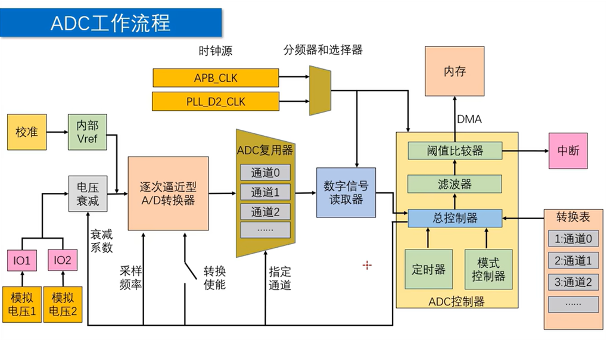

# ADC 转换指南

ADC 是 Analog to Digital Converter，
用于把模拟电压转换为数字量。

ESP-IDF 中常用两种 ADC 驱动模式：

- 单次转换模式
  适合按需采样，
  例如按键检测、电池电压读取、传感器低频读取。

- 连续转换模式
  适合固定频率持续采样，
  例如波形采集、声音包络采样、多通道周期采样。

ADC 读取到的结果通常是原始数字量。
如果需要得到更准确的电压值，
应再配合 ADC 校准驱动转换为 mV。

---

## 初始化流程



典型连续转换模式初始化顺序如下：

1. 定义连续转换句柄。
2. 配置转换结果缓存和转换帧大小。
3. 配置转换表。
4. 配置 ADC 连续转换控制器。
5. 注册转换完成回调函数。
6. 开启连续转换。
7. 读取并解析转换结果。

典型单次转换模式初始化顺序如下：

1. 定义单次转换句柄。
2. 创建 ADC 单元。
3. 配置 ADC 通道。
4. 执行一次转换并读取结果。

---

## 常用参数

### 衰减参数

`atten` 用于设置 ADC 输入衰减。

衰减越大，
ADC 可测量的输入电压上限越高，
但小信号分辨能力会相应变弱。

ESP32 常用参考范围如下：

| 参数 | 参考测量范围 |
| --- | --- |
| `ADC_ATTEN_DB_0` | `100 mV ~ 950 mV` |
| `ADC_ATTEN_DB_2_5` | `100 mV ~ 1250 mV` |
| `ADC_ATTEN_DB_6` | `150 mV ~ 1750 mV` |
| `ADC_ATTEN_DB_12` | `150 mV ~ 2450 mV` |

注意：

- 不同 ESP32 系列芯片的范围可能不同。
- 实际范围应以目标芯片的数据手册为准。
- 如果需要测量接近上限的电压，
  更推荐外部分压后再输入 ADC。

### 转换精度

`bitwidth` 用于设置 ADC 原始结果位宽。

常用值：

- `ADC_BITWIDTH_DEFAULT`
  使用当前芯片支持的默认位宽。

- `ADC_BITWIDTH_12`
  使用 `12 bit` 转换结果。

当位宽为 `12 bit` 时，
原始结果范围通常为 `0 ~ 4095`。

粗略换算电压时可以使用：

```c
voltage_mv = raw * vmax_mv / ((1 << bitwidth) - 1);
```

其中：

- `raw`
  是 ADC 读取到的原始值。

- `vmax_mv`
  是当前衰减档位对应的最大可测电压。

- `bitwidth`
  是 ADC 转换位宽。

注意：

- 该公式只能用于粗略估算。
- ESP32 的 ADC 参考电压存在芯片差异。
- 需要准确电压时应使用 ADC 校准 API。

### ADC 单元和通道

`unit` 用于选择 ADC 单元。

常用值：

- `ADC_UNIT_1`
  使用 ADC1。

- `ADC_UNIT_2`
  使用 ADC2。

`channel` 用于选择 ADC 通道。

通道和 GPIO 的对应关系由芯片决定。
可以查芯片手册，
也可以使用以下函数辅助转换：

- `adc_oneshot_io_to_channel`
  在单次转换模式中，
  根据 GPIO 获取 ADC 单元和通道。

- `adc_continuous_io_to_channel`
  在连续转换模式中，
  根据 GPIO 获取 ADC 单元和通道。

注意：

- ESP32 的 ADC2 会和 Wi-Fi 共用硬件资源。
- 使用 Wi-Fi 时，
  优先选择 ADC1 通道。

---

## 连续转换模式

连续转换模式会按照指定采样频率持续采样，
并把结果写入驱动内部缓存。

应用层再通过读取接口取出数据。

---

## 1. 定义连续转换句柄

```c
#include "esp_adc/adc_continuous.h"

adc_continuous_handle_t adc_handle = NULL;
```

`adc_continuous_handle_t` 是连续转换模式句柄。

后续配置、启动、读取、停止等操作，
都需要通过该句柄指定目标 ADC 驱动实例。

---

## 2. 配置转换结果缓存

```c
#define ADC_MAX_STORE_BUF_SIZE  1024
#define ADC_CONV_FRAME_SIZE     256

adc_continuous_handle_cfg_t adc_handle_cfg = {
    .max_store_buf_size = ADC_MAX_STORE_BUF_SIZE,
    .conv_frame_size = ADC_CONV_FRAME_SIZE,
    .flags.flush_pool = 0,
};

adc_continuous_new_handle(
    &adc_handle_cfg,
    &adc_handle
);
```

配置项说明：

- `max_store_buf_size`
  驱动内部数据池大小，
  单位为字节。

- `conv_frame_size`
  单次转换完成事件对应的数据帧大小，
  单位为字节。

- `flags.flush_pool`
  设置数据池满时的处理方式。

当 `flush_pool = 0` 时，
数据池满后新数据会丢失。

当 `flush_pool = 1` 时，
数据池满后旧数据会被冲掉，
新数据继续写入。

注意：

- `conv_frame_size` 应按转换结果结构大小对齐。
- ESP32 上一个连续转换结果通常占 `SOC_ADC_DIGI_RESULT_BYTES` 字节。
- 如果读取速度慢于采样速度，
  内部数据池可能溢出。

---

## 3. 配置转换表

连续转换模式通过转换表描述每个采样通道。

```c
#define ADC_PATTERN_NUM  1
#define ADC_CHANNEL      ADC_CHANNEL_6

adc_digi_pattern_config_t adc_pattern[ADC_PATTERN_NUM] = {
    {
        .atten = ADC_ATTEN_DB_12,
        .bit_width = ADC_BITWIDTH_DEFAULT,
        .channel = ADC_CHANNEL,
        .unit = ADC_UNIT_1,
    },
};
```

配置项说明：

- `atten`
  ADC 输入衰减档位。

- `bit_width`
  ADC 原始结果位宽。

- `channel`
  ADC 通道编号。

- `unit`
  ADC 单元编号。

如果需要多通道采样，
可以在数组中继续添加配置项。

示例：

```c
adc_digi_pattern_config_t adc_pattern[] = {
    {
        .atten = ADC_ATTEN_DB_12,
        .bit_width = ADC_BITWIDTH_DEFAULT,
        .channel = ADC_CHANNEL_6,
        .unit = ADC_UNIT_1,
    },
    {
        .atten = ADC_ATTEN_DB_12,
        .bit_width = ADC_BITWIDTH_DEFAULT,
        .channel = ADC_CHANNEL_7,
        .unit = ADC_UNIT_1,
    },
};
```

---

## 4. 配置连续转换控制器

```c
#define ADC_SAMPLE_FREQ_HZ  20000

adc_continuous_config_t adc_cfg = {
    .pattern_num = ADC_PATTERN_NUM,
    .adc_pattern = adc_pattern,
    .sample_freq_hz = ADC_SAMPLE_FREQ_HZ,
    .conv_mode = ADC_CONV_SINGLE_UNIT_1,
    .format = ADC_DIGI_OUTPUT_FORMAT_TYPE2,
};

adc_continuous_config(
    adc_handle,
    &adc_cfg
);
```

配置项说明：

- `pattern_num`
  转换表中的通道数量。

- `adc_pattern`
  绑定前面配置好的转换表。

- `sample_freq_hz`
  设置总采样频率，
  单位为 Hz。

- `conv_mode`
  设置 ADC 连续转换模式。

- `format`
  设置 ADC 输出数据格式。

常用 `conv_mode`：

- `ADC_CONV_SINGLE_UNIT_1`
  只使用 ADC1。

- `ADC_CONV_SINGLE_UNIT_2`
  只使用 ADC2。

- `ADC_CONV_BOTH_UNIT`
  ADC1 和 ADC2 同时参与转换。

- `ADC_CONV_ALTER_UNIT`
  ADC1 和 ADC2 轮流参与转换。

注意：

- 如果 `pattern_num = 2`，
  且 `sample_freq_hz = 20000`，
  则每个通道大约得到 `10000 Hz` 的采样率。
- ESP32 使用 Wi-Fi 时，
  不建议选择 ADC2 相关模式。
- `format` 是否支持 `TYPE1` 或 `TYPE2`
  和目标芯片有关。
  ESP32 连续模式常用 `ADC_DIGI_OUTPUT_FORMAT_TYPE2`。

---

## 5. 注册转换完成回调

```c
static bool IRAM_ATTR adc_on_conv_done(
    adc_continuous_handle_t handle,
    const adc_continuous_evt_data_t *edata,
    void *user_data
)
{
    return false;
}

adc_continuous_evt_cbs_t adc_cbs = {
    .on_conv_done = adc_on_conv_done,
    .on_pool_ovf = NULL,
};

adc_continuous_register_event_callbacks(
    adc_handle,
    &adc_cbs,
    NULL
);
```

回调项说明：

- `on_conv_done`
  一个转换帧完成后触发。

- `on_pool_ovf`
  内部数据池溢出时触发。

注意：

- 回调运行在 ISR 上下文。
- 回调中不要执行阻塞操作。
- 如果开启 ISR IRAM 安全选项，
  回调函数和被调用函数应放在 IRAM 中。
- `edata` 中的转换帧缓存由驱动维护，
  不应手动释放。

如果只是轮询读取数据，
也可以不注册回调。

---

## 6. 开启连续转换

```c
adc_continuous_start(adc_handle);
```

调用后，
ADC 开始按照转换表和采样频率持续采样。

停止转换时使用：

```c
adc_continuous_stop(adc_handle);
```

不再使用时释放资源：

```c
adc_continuous_deinit(adc_handle);
```

---

## 7. 读取并解析转换结果

新版本 ESP-IDF 可以使用
`adc_continuous_read_parse`
直接读取并解析结构化数据。

```c
#define ADC_MAX_SAMPLES  64

adc_continuous_data_t samples[ADC_MAX_SAMPLES];
uint32_t sample_count = 0;

esp_err_t ret = adc_continuous_read_parse(
    adc_handle,
    samples,
    ADC_MAX_SAMPLES,
    &sample_count,
    1000
);

if (ret == ESP_OK) {
    for (uint32_t i = 0; i < sample_count; i++) {
        if (samples[i].valid) {
            uint32_t raw = samples[i].raw_data;
            adc_unit_t unit = samples[i].unit;
            adc_channel_t channel = samples[i].channel;
        }
    }
}
```

参数说明：

- `samples`
  用于保存解析后的 ADC 数据。

- `ADC_MAX_SAMPLES`
  本次最多读取多少个样本。

- `sample_count`
  实际读取到的样本数量。

- `timeout_ms`
  等待数据的超时时间，
  单位为 ms。

如果工程使用的 ESP-IDF 版本没有
`adc_continuous_read_parse`，
可以先调用 `adc_continuous_read`
读取原始字节流，
再按 `SOC_ADC_DIGI_RESULT_BYTES`
拆分为转换结果。

---

## 连续转换完整示例

```c
#include "esp_adc/adc_continuous.h"

#define ADC_UNIT_ID             ADC_UNIT_1
#define ADC_CHANNEL_ID          ADC_CHANNEL_6
#define ADC_ATTEN_ID            ADC_ATTEN_DB_12
#define ADC_PATTERN_NUM         1
#define ADC_SAMPLE_FREQ_HZ      20000
#define ADC_MAX_STORE_BUF_SIZE  1024
#define ADC_CONV_FRAME_SIZE     256
#define ADC_MAX_SAMPLES         64

static adc_continuous_handle_t adc_handle = NULL;

static bool IRAM_ATTR adc_on_conv_done(
    adc_continuous_handle_t handle,
    const adc_continuous_evt_data_t *edata,
    void *user_data
)
{
    return false;
}

void adc_continuous_init(void)
{
    adc_continuous_handle_cfg_t handle_cfg = {
        .max_store_buf_size = ADC_MAX_STORE_BUF_SIZE,
        .conv_frame_size = ADC_CONV_FRAME_SIZE,
        .flags.flush_pool = 0,
    };

    adc_continuous_new_handle(
        &handle_cfg,
        &adc_handle
    );

    adc_digi_pattern_config_t adc_pattern[ADC_PATTERN_NUM] = {
        {
            .atten = ADC_ATTEN_ID,
            .bit_width = ADC_BITWIDTH_DEFAULT,
            .channel = ADC_CHANNEL_ID,
            .unit = ADC_UNIT_ID,
        },
    };

    adc_continuous_config_t adc_cfg = {
        .pattern_num = ADC_PATTERN_NUM,
        .adc_pattern = adc_pattern,
        .sample_freq_hz = ADC_SAMPLE_FREQ_HZ,
        .conv_mode = ADC_CONV_SINGLE_UNIT_1,
        .format = ADC_DIGI_OUTPUT_FORMAT_TYPE2,
    };

    adc_continuous_config(
        adc_handle,
        &adc_cfg
    );

    adc_continuous_evt_cbs_t cbs = {
        .on_conv_done = adc_on_conv_done,
    };

    adc_continuous_register_event_callbacks(
        adc_handle,
        &cbs,
        NULL
    );

    adc_continuous_start(adc_handle);
}

void adc_continuous_read_once(void)
{
    adc_continuous_data_t samples[ADC_MAX_SAMPLES];
    uint32_t sample_count = 0;

    esp_err_t ret = adc_continuous_read_parse(
        adc_handle,
        samples,
        ADC_MAX_SAMPLES,
        &sample_count,
        1000
    );

    if (ret != ESP_OK) {
        return;
    }

    for (uint32_t i = 0; i < sample_count; i++) {
        if (!samples[i].valid) {
            continue;
        }

        uint32_t raw = samples[i].raw_data;
        adc_unit_t unit = samples[i].unit;
        adc_channel_t channel = samples[i].channel;

        (void)raw;
        (void)unit;
        (void)channel;
    }
}
```

以上示例表示：

- 使用 ADC1 的 `ADC_CHANNEL_6`。
- 衰减档位为 `ADC_ATTEN_DB_12`。
- 总采样频率为 `20000 Hz`。
- 每次最多读取 `64` 个样本。

---

## 单次转换模式

单次转换模式只在调用读取函数时进行一次采样。

它更适合低频读取，
初始化和使用都比连续转换模式简单。

---

## 1. 定义并创建 ADC 单元

```c
#include "esp_adc/adc_oneshot.h"

adc_oneshot_unit_handle_t adc_handle = NULL;

adc_oneshot_unit_init_cfg_t oneshot_cfg = {
    .unit_id = ADC_UNIT_1,
    .clk_src = 0,
    .ulp_mode = ADC_ULP_MODE_DISABLE,
};

adc_oneshot_new_unit(
    &oneshot_cfg,
    &adc_handle
);
```

配置项说明：

- `unit_id`
  选择 ADC 单元，
  常用 `ADC_UNIT_1` 或 `ADC_UNIT_2`。

- `clk_src`
  选择 ADC 时钟源。
  设置为 `0` 时，
  驱动会使用默认时钟源。

- `ulp_mode`
  设置 ADC 是否由 ULP 协处理器控制。
  普通应用一般使用 `ADC_ULP_MODE_DISABLE`。

---

## 2. 配置 ADC 通道

```c
adc_oneshot_chan_cfg_t oneshot_chan_cfg = {
    .atten = ADC_ATTEN_DB_12,
    .bitwidth = ADC_BITWIDTH_DEFAULT,
};

adc_oneshot_config_channel(
    adc_handle,
    ADC_CHANNEL_6,
    &oneshot_chan_cfg
);
```

配置项说明：

- `atten`
  ADC 输入衰减档位。

- `bitwidth`
  ADC 原始结果位宽。

`adc_oneshot_config_channel`
可以被多次调用，
用于配置同一个 ADC 单元下的多个通道。

---

## 3. 执行一次转换并读取结果

```c
int raw = 0;

adc_oneshot_read(
    adc_handle,
    ADC_CHANNEL_6,
    &raw
);
```

`raw` 即 ADC 原始采样结果。

注意：

- `adc_oneshot_read` 不应在 ISR 中调用。
- 如果 ADC 被其它外设占用，
  读取可能返回超时错误。
- 需要 mV 电压值时，
  应使用 ADC 校准驱动。

不再使用时释放 ADC 单元：

```c
adc_oneshot_del_unit(adc_handle);
```

---

## 单次转换完整示例

```c
#include "esp_adc/adc_oneshot.h"

#define ADC_UNIT_ID     ADC_UNIT_1
#define ADC_CHANNEL_ID  ADC_CHANNEL_6
#define ADC_ATTEN_ID    ADC_ATTEN_DB_12

static adc_oneshot_unit_handle_t adc_handle = NULL;

void adc_oneshot_init(void)
{
    adc_oneshot_unit_init_cfg_t unit_cfg = {
        .unit_id = ADC_UNIT_ID,
        .clk_src = 0,
        .ulp_mode = ADC_ULP_MODE_DISABLE,
    };

    adc_oneshot_new_unit(
        &unit_cfg,
        &adc_handle
    );

    adc_oneshot_chan_cfg_t channel_cfg = {
        .atten = ADC_ATTEN_ID,
        .bitwidth = ADC_BITWIDTH_DEFAULT,
    };

    adc_oneshot_config_channel(
        adc_handle,
        ADC_CHANNEL_ID,
        &channel_cfg
    );
}

int adc_oneshot_read_raw(void)
{
    int raw = 0;

    adc_oneshot_read(
        adc_handle,
        ADC_CHANNEL_ID,
        &raw
    );

    return raw;
}
```

以上示例表示：

- 使用 ADC1 的 `ADC_CHANNEL_6`。
- 衰减档位为 `ADC_ATTEN_DB_12`。
- 调用 `adc_oneshot_read_raw`
  时执行一次采样并返回原始值。

---

## 常见注意点

### 优先选择 ADC1

ESP32 的 ADC2 会和 Wi-Fi 共用硬件资源。

如果项目需要联网，
优先选择 ADC1 通道，
可以减少资源冲突。

### 原始值不等于准确电压

ADC 原始值只表示数字采样结果。

如果要得到较准确的 mV 值，
应使用 ADC 校准驱动，
不要只依赖手动线性换算。

### 采样频率不要盲目拉高

连续转换模式中，
如果采样速度高于任务处理速度，
驱动内部缓存会溢出。

出现丢数时可以：

- 降低 `sample_freq_hz`。
- 增大 `max_store_buf_size`。
- 提高读取任务优先级。
- 减少回调和数据处理中的耗时逻辑。

### 分压后再输入 ADC

ADC 输入电压不能超过芯片允许范围。

测量电池、电源、电机电压等较高电压时，
应先用电阻分压，
再把分压后的电压输入 ADC。

---

## 速查

1. `adc_continuous_new_handle`
   创建连续转换模式句柄。

2. `adc_continuous_config`
   配置连续转换表、采样频率和输出格式。

3. `adc_continuous_register_event_callbacks`
   注册连续转换事件回调。

4. `adc_continuous_start`
   启动连续转换。

5. `adc_continuous_read_parse`
   读取并解析连续转换结果。

6. `adc_oneshot_new_unit`
   创建单次转换 ADC 单元。

7. `adc_oneshot_config_channel`
   配置单次转换 ADC 通道。

8. `adc_oneshot_read`
   执行一次 ADC 采样并读取原始值。

---

## 后续扩展复习点

1. ADC 校准驱动
   继续学习 `adc_cali_create_scheme_line_fitting`、
   `adc_cali_raw_to_voltage`，
   以及不同芯片 eFuse 校准数据的差异。

2. 衰减档位和输入范围
   复习 `ADC_ATTEN_DB_0`、
   `ADC_ATTEN_DB_2_5`、
   `ADC_ATTEN_DB_6`、
   `ADC_ATTEN_DB_12` 在不同 ESP32 系列上的实际范围。

3. ADC1 和 ADC2 资源冲突
   深入理解 Wi-Fi 使用时为什么优先选择 ADC1。

4. 连续采样数据格式
   复习 `ADC_DIGI_OUTPUT_FORMAT_TYPE1`、
   `ADC_DIGI_OUTPUT_FORMAT_TYPE2`、
   `SOC_ADC_DIGI_RESULT_BYTES` 的关系。

5. 采样频率和多通道分配
   整理 `sample_freq_hz` 在多通道 pattern 中如何分摊。

6. 输入阻抗和前端电路
   学习分压电阻、滤波电容、
   传感器输出阻抗对 ADC 读数稳定性的影响。
