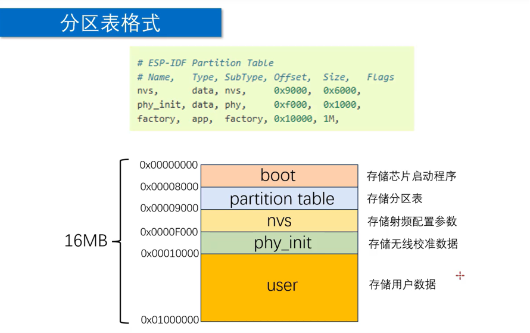
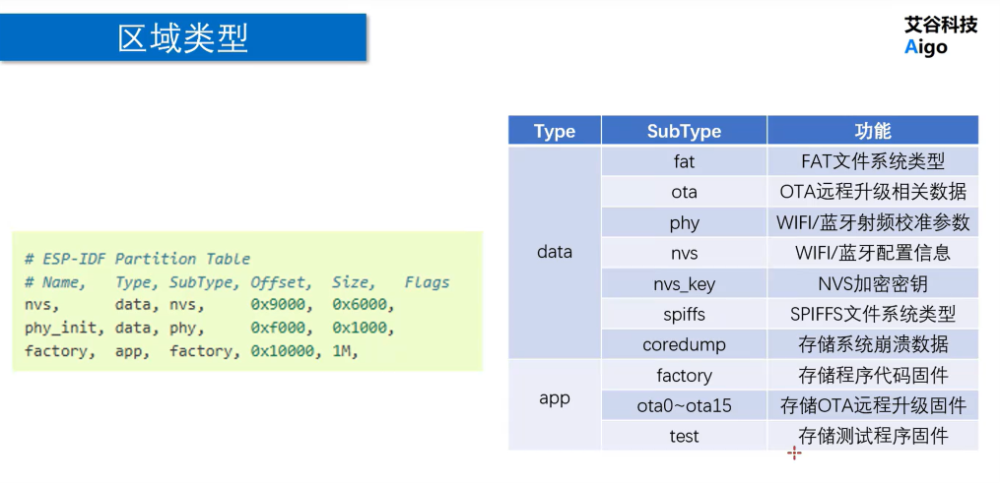
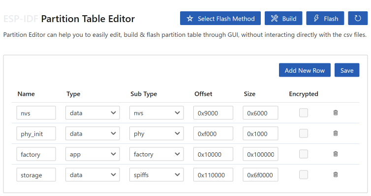

# FLASH 存储指南

SPIFFS 是 ESP-IDF 中内置的轻量级文件系统，
常用于在 ESP32 片内或片外 Flash 上持久化存储配置文件、日志、网页资源等小文件。

ESP32 上使用 Flash 文件存储的核心思路是：
先通过分区表在 Flash 上划出一块区域给 SPIFFS，
再调用 `esp_vfs_spiffs_register()` 挂载，
挂载后使用 C 标准文件接口读写。

---

## 初始化流程



典型初始化顺序如下：

1. SDK menuconfig 中选择自定义分区表。
2. 使用分区表编辑器创建自定义分区表。
3. 使用 `esp_vfs_spiffs_register()` 挂载 SPIFFS。
4. 使用 C 语言文件操作函数读写 Flash 文件。

---

## 常用概念

### SPIFFS

SPIFFS（SPI Flash File System）是面向 SPI NOR Flash 设计的轻量级文件系统。

它支持磨损均衡、目录结构和标准的 POSIX 风格文件操作，
但不支持并发写入保护。
多任务写入同一文件时，
应用层需要自行加锁。

### 分区表

分区表定义 Flash 上各区域的起始地址、大小和用途。

ESP-IDF 默认分区表包含：
`nvs`（非易失存储）、
`phy_init`（PHY 初始化数据）、
`factory`（固件 app）等区域。

如果要使用 SPIFFS，
需要在分区表中额外添加一个 `data` 类型、`spiffs` 子类型的分区。

### VFS

VFS（Virtual File System）是 ESP-IDF 的虚拟文件系统层。

SPIFFS 通过 VFS 注册后，
应用层可以用 `fopen`、`fread`、`fwrite` 等标准 C 接口操作文件，
无需关心底层是 Flash 还是 SD 卡。

### 挂载点

挂载点是一个以 `/` 开头的路径前缀，
例如 `/storage`。

SPIFFS 注册时指定的 `base_path` 就是这个挂载点。
挂载成功后，
所有以该路径开头的文件操作都会映射到 SPIFFS 分区。

---

## 1. 选择自定义分区表

打开 SDK Configuration Editor（菜单中点击齿轮图标），
进入 `Partition Table` 子菜单，
将 `Partition Table` 选项设置为 `Custom partition table CSV`。

该选项共有 5 种取值：

| 选项 | OTA 支持 | app 分区大小 | 适用场景 |
| --- | --- | --- | --- |
| `Single factory app, no OTA` | 不支持 | 默认大小 | 简单项目，无需 OTA 升级 |
| `Factory app, two OTA definitions` | 支持 | 默认大小 | 需要 OTA 升级的标准项目 |
| `Custom partition table CSV` | 自定义 | 自定义 | 需要 SPIFFS 或自定义分区布局 |
| `Single factory app (large), no OTA` | 不支持 | 大分区 | 无 OTA 需求但固件较大的项目 |
| `Factory app, two OTA definitions (large)` | 支持 | 大分区 | 需 OTA 且固件较大的项目 |

选用 `Custom partition table CSV` 后，
还需要在项目中提供自定义分区表 CSV 文件，
或在下一步中使用分区表编辑器生成。

---

## 2. 使用分区表编辑器创建分区表

在 VS Code 中按 `Ctrl+Shift+P` 打开命令面板，
搜索 `Partition Table Editor` 打开分区表编辑器。

分区表编辑器中按照标准格式创建分区，
常用区域类型如下：



分区时的注意点：

- **总 Flash 大小**
  根据芯片型号选择（如 4 MB、8 MB、16 MB）。
  ESP32 标准模组通常为 4 MB 或 8 MB。

- **bootloader 和 partition table**
  这两个区域由系统自动生成，
  不需要手动更改。

- **nvs 和 phy_init**
  这两个区域保存 Wi-Fi 校准数据和 PHY 初始化参数，
  通常保持默认大小和位置即可。

- **factory 或 ota 分区**
  用于存放应用程序固件。
  `factory` 用于无 OTA 场景，
  `ota_0`、`ota_1` 配合 `otadata` 用于 OTA 场景。

- **spiffs 分区（user 区域）**
  `Type` 选择 `data`，
  `Subtype` 选择 `spiffs`。
  名称可以自定义，
  后续代码中的 `partition_label` 需要与此名称一致。

以下为 8 MB Flash 的配置示例：



该示例中 `storage` 分区被指定为 SPIFFS 类型，
代码中挂载时 `partition_label` 应设置为 `"storage"`。

---

## 3. 挂载 SPIFFS

```c
#include "esp_spiffs.h"

esp_vfs_spiffs_conf_t spiffs_cfg = {
    .base_path = "/storage",
    .partition_label = "storage",
    .max_files = 2,
    .format_if_mount_failed = true,
};

esp_vfs_spiffs_register(&spiffs_cfg);
```

配置项说明：

- `base_path`
  挂载点路径。
  挂载成功后，
  所有以 `/storage` 开头的文件路径都会映射到 SPIFFS 分区。

- `partition_label`
  SPIFFS 分区在分区表中的名称。
  需要和分区表编辑器中设置的名称保持一致。
  如果不填（或设为 `NULL`），
  驱动会使用分区表中第一个 `data` + `spiffs` 分区。

- `max_files`
  允许同时打开的最大文件数。
  简单读写场景一般设置为 `2 ~ 5`。
  每增加一个文件会消耗少量内存。

- `format_if_mount_failed`
  挂载失败时是否自动格式化分区。
  首次烧录或分区表变更后，
  分区可能尚未格式化，
  此时需要将此字段设为 `true`。
  如果 Flash 中已有重要数据，
  应设为 `false` 以避免数据丢失。

注意：

- 如果 `esp_vfs_spiffs_register` 返回 `ESP_ERR_NOT_FOUND`，
  通常说明分区表中找不到指定的 `partition_label`。
- 如果返回 `ESP_FAIL`，
  可能是分区尚未格式化且 `format_if_mount_failed` 为 `false`。

可以调用以下函数检查 SPIFFS 使用情况：

```c
size_t total = 0, used = 0;

esp_spiffs_info("storage", &total, &used);

printf("SPIFFS: %zu / %zu bytes used\n", used, total);
```

---

## 4. 使用 C 文件接口读写 Flash

SPIFFS 挂载后，
文件操作和普通 C 文件操作一致。

写文件示例：

```c
FILE *file = fopen("/storage/config.txt", "w");

if (file != NULL) {
    fprintf(file, "key=value\n");
    fclose(file);
}
```

读文件示例：

```c
char line[64];
FILE *file = fopen("/storage/config.txt", "r");

if (file != NULL) {
    while (fgets(line, sizeof(line), file) != NULL) {
        printf("%s", line);
    }

    fclose(file);
}
```

常见文件模式：

| 模式 | 含义 |
| --- | --- |
| `"r"` | 只读，文件必须存在 |
| `"w"` | 写入，文件不存在则创建，存在则清空 |
| `"a"` | 追加写入，文件不存在则创建 |
| `"r+"` | 读写，文件必须存在 |
| `"w+"` | 读写，文件不存在则创建，存在则清空 |
| `"a+"` | 读和追加写入，文件不存在则创建 |

注意：

- SPIFFS 不支持目录层级中的子目录创建。
  所有文件应直接放在挂载点下。
- 文件名总长度（含挂载点前缀）不能超过 SPIFFS 的限制。
- 写完重要数据后应及时 `fclose`。

---

## 完整示例

```c
#include <stdio.h>
#include <string.h>
#include "esp_spiffs.h"
#include "esp_log.h"

#define STORAGE_BASE_PATH  "/storage"
#define STORAGE_LABEL      "storage"

static const char *TAG = "flash_storage";

void flash_storage_init(void)
{
    esp_vfs_spiffs_conf_t spiffs_cfg = {
        .base_path = STORAGE_BASE_PATH,
        .partition_label = STORAGE_LABEL,
        .max_files = 3,
        .format_if_mount_failed = true,
    };

    ESP_ERROR_CHECK(
        esp_vfs_spiffs_register(&spiffs_cfg)
    );

    size_t total = 0, used = 0;
    esp_spiffs_info(STORAGE_LABEL, &total, &used);

    ESP_LOGI(TAG,
        "SPIFFS mounted: %zu / %zu bytes used",
        used, total
    );
}

esp_err_t flash_storage_write(
    const char *filename,
    const char *data
)
{
    char path[64];
    snprintf(path, sizeof(path),
        "%s/%s", STORAGE_BASE_PATH, filename);

    FILE *file = fopen(path, "w");

    if (file == NULL) {
        return ESP_FAIL;
    }

    fprintf(file, "%s", data);
    fclose(file);

    return ESP_OK;
}

esp_err_t flash_storage_read(
    const char *filename,
    char *buf,
    size_t buf_size
)
{
    char path[64];
    snprintf(path, sizeof(path),
        "%s/%s", STORAGE_BASE_PATH, filename);

    FILE *file = fopen(path, "r");

    if (file == NULL) {
        return ESP_FAIL;
    }

    size_t n = fread(buf, 1, buf_size - 1, file);
    buf[n] = '\0';
    fclose(file);

    return ESP_OK;
}
```

以上示例表示：

- 挂载点为 `/storage`。
- 分区标签为 `storage`，和分区表中的 `storage` 分区对应。
- 最多同时打开 3 个文件。
- 挂载失败时自动格式化。
- `flash_storage_write` 和 `flash_storage_read`
  封装了基本的文件读写操作。

---

## 常见注意点

### 分区标签必须和分区表一致

`esp_vfs_spiffs_conf_t.partition_label` 的值
必须和分区表中 `Name` 字段完全一致。

如果不一致，
`esp_vfs_spiffs_register` 会返回 `ESP_ERR_NOT_FOUND`。

### 写完后要 fclose

SPIFFS 不会在每次 `fprintf` 或 `fwrite` 后立即把数据写到 Flash。

只有调用 `fclose` 后，
数据才会真正写入。
如果在 `fclose` 前断电或复位，
本次写入的数据可能丢失。

### SPIFFS 不支持子目录

SPIFFS 是扁平文件系统，
不支持 `mkdir` 或多级目录结构。

所有文件直接放在挂载点下，
例如 `/storage/log.txt`，
而不是 `/storage/logs/log.txt`。

### max_files 影响内存占用

每增加一个 `max_files`，
SPIFFS 会额外分配文件描述符和缓存。

简单场景设置为 `2 ~ 5` 即可。
如果打开文件时返回错误，
检查是否同时打开的文件数超过了 `max_files`。

### 频繁小块写入会降低 Flash 寿命

Flash 有写入次数限制。
频繁写入小数据会加速磨损。

日志类场景建议在内存中缓存一段时间，
再批量写入 Flash。

### 首次烧录需要格式化

全新烧录或分区表变更后，
SPIFFS 分区是空的。

此时必须将 `format_if_mount_failed` 设为 `true`，
否则 `esp_vfs_spiffs_register` 会因未格式化而失败。

---

## 速查

1. `esp_vfs_spiffs_register`
   挂载 SPIFFS 分区到 VFS。

2. `esp_vfs_spiffs_unregister`
   卸载 SPIFFS 分区。

3. `esp_spiffs_info`
   查询 SPIFFS 分区的总大小和已用大小。

4. `esp_spiffs_format`
   手动格式化 SPIFFS 分区。

5. `fopen` / `fclose`
   打开 / 关闭文件。

6. `fprintf` / `fwrite`
   向文件写入数据。

7. `fgets` / `fread` / `fscanf`
   从文件读取数据。

8. `remove`
   删除指定文件。

9. `rename`
   重命名文件。

---

## 后续扩展复习点

1. SPIFFS 磨损均衡
   进一步理解 SPIFFS 的磨损均衡策略、
   垃圾回收机制和写入放大。

2. 分区表 CSV 格式
   直接手写分区表 CSV 文件，
   理解每列（Name, Type, SubType, Offset, Size, Flags）的具体含义。

3. 其他 ESP-IDF 文件系统
   对比 SPIFFS、LittleFS、FatFS 在 Flash 上的性能、
   磨损均衡和功能差异。

4. NVS 和 SPIFFS 的区别
   NVS 适合键值对配置存储，
   SPIFFS 适合文件存储。
   进一步理解两者各自适用的场景。

5. OTA 和自定义分区表的配合
   在支持 OTA 的分区表中添加 SPIFFS 分区，
   理解 ota_0、ota_1、otadata 和 SPIFFS 分区的共存布局。

6. 加密 SPIFFS 分区
   学习 Flash Encryption 和 NVS Encryption 对 SPIFFS 分区的影响。

7. 多任务并发访问
   复习 FreeRTOS 互斥锁在 SPIFFS 多任务写入场景中的使用方式。
