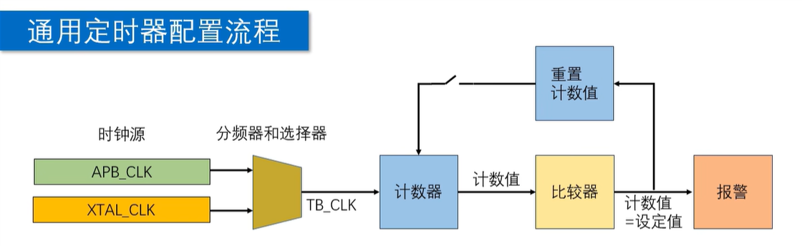

# GPTimer（通用定时器）指南

GPTimer 是 ESP-IDF 提供的通用硬件定时器驱动。

它常用于周期性任务、精确定时、超时检测，
以及需要在定时到达后触发回调的场景。

---

## 初始化流程



典型初始化顺序如下：

1. 定义定时器句柄。
2. 创建并配置定时器。
3. 配置报警比较器。
4. 注册报警回调函数。
5. 使能定时器。
6. 启动定时器。

---

## 1. 定义定时器句柄

```c
gptimer_handle_t gptimer_name;
```

`gptimer_handle_t` 是 GPTimer 的句柄类型。

后续配置、使能、启动、停止等操作，
都需要通过这个句柄指定目标定时器。

---

## 2. 创建定时器

```c
esp_err_t gptimer_new_timer(
    const gptimer_config_t *config,
    gptimer_handle_t *ret_timer
);
```

该函数用于根据 `config` 创建定时器，
并通过 `ret_timer` 返回定时器句柄。

示例配置：

```c
gptimer_config_t gptimer_cfg = {
    .clk_src =
        GPTIMER_CLK_SRC_DEFAULT,
    .direction = GPTIMER_COUNT_UP,
    .flags.intr_shared = 0,
    .intr_priority = 0,
    .resolution_hz = 1000000,
};
```

配置项说明：

- `clk_src`
  选择定时器时钟源。

- `direction`
  设置向上计数或向下计数。

- `flags.intr_shared`
  设置是否共享中断资源。

- `intr_priority`
  设置中断优先级。
  `0` 表示自动分配。

- `resolution_hz`
  设置定时器分辨率，
  单位为 Hz。

当 `resolution_hz = 1000000` 时，
定时器每秒计数 `1,000,000` 次。

也就是每 `1 us` 计数一次。

---

## 3. 配置报警比较器

```c
esp_err_t gptimer_set_alarm_action(
    gptimer_handle_t timer,
    const gptimer_alarm_config_t *config
);
```

该函数用于设置定时器的报警动作。

当计数值到达 `alarm_count` 时，
GPTimer 会触发报警事件。

示例配置：

```c
gptimer_alarm_config_t
gptimer_alarm_cfg = {
    .alarm_count = 100000,
    .flags.auto_reload_on_alarm = 1,
    .reload_count = 0,
};
```

配置项说明：

- `alarm_count`
  报警阈值。

- `auto_reload_on_alarm`
  设置报警后是否自动重装载。

- `reload_count`
  设置自动重装载后的计数值。

以上配置表示：

- 定时器计数到 `100000` 时触发报警。
- 报警后自动回到 `0` 重新计数。
- 若分辨率为 `1 MHz`，周期为 `100 ms`。

---

## 4. 注册回调函数

```c
esp_err_t gptimer_register_event_callbacks(
    gptimer_handle_t timer,
    const gptimer_event_callbacks_t *cbs,
    void *user_data
);
```

该函数用于绑定 GPTimer 事件回调。

最常用的是 `on_alarm`，
即报警触发时调用的函数。

示例配置：

```c
gptimer_event_callbacks_t
gptimer_callback_cfg = {
    .on_alarm = LED_timercallback,
};
```

回调函数格式：

```c
bool IRAM_ATTR LED_timercallback(
    gptimer_handle_t timer,
    const gptimer_alarm_event_data_t *edata,
    void *user_ctx
)
{
    return false;
}
```

`IRAM_ATTR` 表示将函数放入 IRAM。

这样可以减少从 Flash 取指带来的延迟，
更适合中断回调这类高实时性代码。

注意：

- IRAM 空间有限，不应放入过大的函数。
- 若使用 `IRAM_ATTR`，需要确认工程配置支持。
- 回调中应避免耗时操作。

---

## 5. 使能定时器

```c
esp_err_t gptimer_enable(
    gptimer_handle_t timer
);
```

使能后，GPTimer 进入可工作状态。

通常在完成定时器配置和回调注册后调用。

---

## 6. 启动定时器

```c
esp_err_t gptimer_start(
    gptimer_handle_t timer
);
```

调用后，定时器开始计数。

若已配置报警比较器，
计数到阈值时会触发报警事件。

---

## 完整示例

```c
static bool IRAM_ATTR LED_timercallback(
    gptimer_handle_t timer,
    const gptimer_alarm_event_data_t *edata,
    void *user_ctx
)
{
    return false;
}

void gptimer_init(void)
{
    gptimer_handle_t gptimer_name = NULL;

    gptimer_config_t gptimer_cfg = {
        .clk_src =
            GPTIMER_CLK_SRC_DEFAULT,
        .direction = GPTIMER_COUNT_UP,
        .flags.intr_shared = 0,
        .intr_priority = 0,
        .resolution_hz = 1000000,
    };

    gptimer_new_timer(
        &gptimer_cfg,
        &gptimer_name
    );

    gptimer_alarm_config_t
    gptimer_alarm_cfg = {
        .alarm_count = 100000,
        .flags.auto_reload_on_alarm = 1,
        .reload_count = 0,
    };

    gptimer_set_alarm_action(
        gptimer_name,
        &gptimer_alarm_cfg
    );

    gptimer_event_callbacks_t
    callback_cfg = {
        .on_alarm = LED_timercallback,
    };

    gptimer_register_event_callbacks(
        gptimer_name,
        &callback_cfg,
        NULL
    );

    gptimer_enable(gptimer_name);
    gptimer_start(gptimer_name);
}
```

---

## 速查

1. `gptimer_new_timer`
   创建定时器。

2. `gptimer_set_alarm_action`
   设置报警阈值。

3. `gptimer_register_event_callbacks`
   注册事件回调。

4. `gptimer_enable`
   使能定时器。

5. `gptimer_start`
   启动计数。
