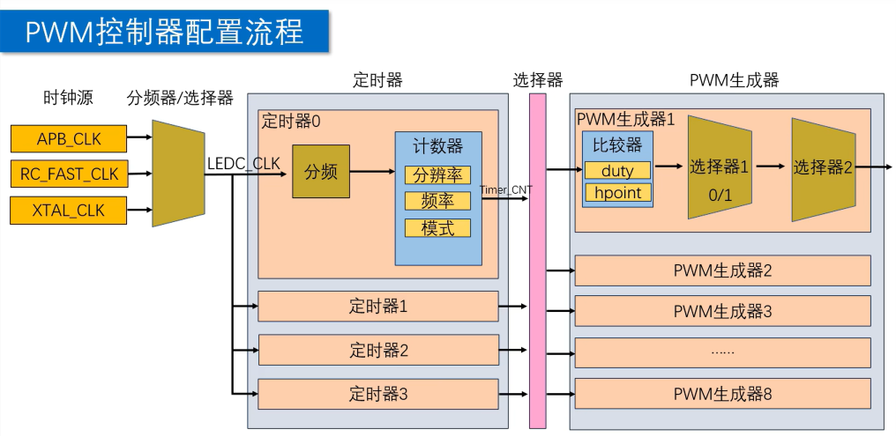
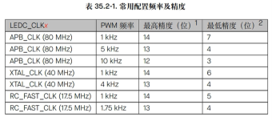

# PWM 初始化指南

PWM 在 ESP-IDF 中通常使用 LEDC 驱动完成。

LEDC 可以输出指定频率和占空比的方波，
常用于 LED 调光、电机调速、蜂鸣器驱动等场景。

---

## 初始化流程



典型初始化顺序如下：

1. 配置 LEDC 定时器。
2. 配置 LEDC 通道并绑定 GPIO。
3. 设置占空比。
4. 更新占空比输出。

---

## 常用概念

### LEDC

LEDC 是 ESP-IDF 中常用的 PWM 输出驱动。

它通过定时器产生计数基准，
再由通道把 PWM 波形输出到指定 GPIO。

### Timer

LEDC 定时器决定 PWM 的频率和占空比精度。

多个通道可以共用同一个定时器，
但它们会共享相同的频率和精度。

### Channel

LEDC 通道决定 PWM 输出到哪个 GPIO。

一个通道需要绑定一个已经配置好的 LEDC 定时器。

### Duty

Duty 表示占空比计数值。

它不是百分比本身，
而是和 `duty_resolution` 对应的原始计数值。

### Resolution

`duty_resolution` 表示占空比精度。

精度越高，
占空比可调级数越多；
但在同一时钟源下，
可支持的最高 PWM 频率会下降。

---

## 1. 配置 LEDC 定时器

LEDC 定时器决定 PWM 的频率和占空比精度。



示例配置：

```c
ledc_timer_config_t timer_cfg = {
    .clk_cfg = LEDC_AUTO_CLK,
    .duty_resolution = LEDC_TIMER_13_BIT,
    .freq_hz = 1000,
    .speed_mode = LEDC_LOW_SPEED_MODE,
    .timer_num = LEDC_TIMER_0,
};

ledc_timer_config(&timer_cfg);
```

配置项说明：

- `clk_cfg`
  选择 LEDC 使用的时钟源。
  一般可以先使用 `LEDC_AUTO_CLK`。

- `duty_resolution`
  设置占空比精度。
  精度越高，占空比可调级数越多。

- `freq_hz`
  设置 PWM 输出频率，单位为 Hz。
  当 `freq_hz = 1000` 时，PWM 周期为 `1 ms`。

- `speed_mode`
  设置 LEDC 速度模式。
  通常使用 `LEDC_LOW_SPEED_MODE`。

- `timer_num`
  选择 LEDC 定时器编号。
  后续通道需要绑定到这个定时器。

注意：

- PWM 频率和占空比精度互相制约。
- 频率越高，可用的占空比精度通常越低。
- 如果 `ledc_timer_config` 返回失败，
  优先检查频率和精度组合是否可用。

---

## 2. 配置 LEDC 通道

LEDC 通道决定 PWM 输出到哪个 GPIO，
并指定使用哪个定时器产生波形。

示例配置：

```c
ledc_channel_config_t channel_cfg = {
    .channel = LEDC_CHANNEL_0,
    .duty = 0,
    .flags.output_invert = 0,
    .gpio_num = PWM_GPIO,
    .hpoint = 0,
    .intr_type = LEDC_INTR_DISABLE,
    .speed_mode = LEDC_LOW_SPEED_MODE,
    .timer_sel = LEDC_TIMER_0,
};

ledc_channel_config(&channel_cfg);
```

配置项说明：

- `channel`
  选择 LEDC 通道编号。

- `duty`
  设置初始占空比。
  初始化时通常先设为 `0`。

- `flags.output_invert`
  设置输出电平是否反转。
  `0` 表示不反转。

- `gpio_num`
  绑定 PWM 输出 GPIO。

- `hpoint`
  设置 PWM 高电平起始计数点。
  普通 PWM 输出一般设为 `0`。

- `intr_type`
  设置 LEDC 中断类型。
  不需要中断时使用 `LEDC_INTR_DISABLE`。

- `speed_mode`
  通道速度模式。
  应与前面的定时器配置保持一致。

- `timer_sel`
  选择该通道绑定的 LEDC 定时器。

---

## 3. 修改并更新占空比

修改占空比需要先设置新值，
再调用更新函数让输出生效。

```c
ledc_set_duty(
    LEDC_LOW_SPEED_MODE,
    LEDC_CHANNEL_0,
    duty
);

ledc_update_duty(
    LEDC_LOW_SPEED_MODE,
    LEDC_CHANNEL_0
);
```

`duty` 的取值和 `duty_resolution` 有关。

例如使用 `LEDC_TIMER_13_BIT` 时，
可以按 `0` 到 `(1 << 13) - 1` 计算占空比。

50% 占空比示例：

```c
uint32_t duty = ((1 << 13) - 1) / 2;

ledc_set_duty(
    LEDC_LOW_SPEED_MODE,
    LEDC_CHANNEL_0,
    duty
);

ledc_update_duty(
    LEDC_LOW_SPEED_MODE,
    LEDC_CHANNEL_0
);
```

---

## 完整示例

```c
#include "driver/ledc.h"

#define PWM_GPIO        18
#define PWM_FREQ_HZ     1000
#define PWM_DUTY_RES    LEDC_TIMER_13_BIT
#define PWM_TIMER       LEDC_TIMER_0
#define PWM_MODE        LEDC_LOW_SPEED_MODE
#define PWM_CHANNEL     LEDC_CHANNEL_0

void pwm_init(void)
{
    ledc_timer_config_t timer_cfg = {
        .clk_cfg = LEDC_AUTO_CLK,
        .duty_resolution = PWM_DUTY_RES,
        .freq_hz = PWM_FREQ_HZ,
        .speed_mode = PWM_MODE,
        .timer_num = PWM_TIMER,
    };

    ledc_timer_config(&timer_cfg);

    ledc_channel_config_t channel_cfg = {
        .channel = PWM_CHANNEL,
        .duty = 0,
        .flags.output_invert = 0,
        .gpio_num = PWM_GPIO,
        .hpoint = 0,
        .intr_type = LEDC_INTR_DISABLE,
        .speed_mode = PWM_MODE,
        .timer_sel = PWM_TIMER,
    };

    ledc_channel_config(&channel_cfg);
}

void pwm_set_duty_percent(uint32_t percent)
{
    if (percent > 100) {
        percent = 100;
    }

    uint32_t max_duty =
        (1U << PWM_DUTY_RES) - 1;

    uint32_t duty =
        max_duty * percent / 100;

    ledc_set_duty(
        PWM_MODE,
        PWM_CHANNEL,
        duty
    );

    ledc_update_duty(
        PWM_MODE,
        PWM_CHANNEL
    );
}
```

以上示例表示：

- 使用 `GPIO18` 输出 PWM。
- PWM 频率为 `1000 Hz`。
- 占空比精度为 `13 bit`。
- 可以通过 `pwm_set_duty_percent`
  按百分比修改占空比。

---

## 常见注意点

### 频率和精度需要匹配

如果频率设置过高，
可用占空比精度会下降。

配置失败时，
优先降低 `duty_resolution`
或降低 `freq_hz`。

### 定时器和通道要对应

通道中的 `speed_mode` 和 `timer_sel`
需要对应前面配置过的定时器。

多个通道可以共用同一个定时器，
但它们会共享相同的频率和精度。

### 修改占空比后要更新

调用 `ledc_set_duty` 后，
还需要调用 `ledc_update_duty`，
新的占空比才会输出到 GPIO。

---

## 速查

1. `ledc_timer_config`
   配置 LEDC 定时器。

2. `ledc_channel_config`
   配置 LEDC 通道并绑定 GPIO。

3. `ledc_set_duty`
   设置新的占空比。

4. `ledc_update_duty`
   更新占空比输出。

---

## 后续扩展复习点

1. 频率和精度换算
   进一步整理 `freq_hz`、
   `duty_resolution`、
   LEDC 时钟源之间的约束关系。

2. 高速模式和低速模式
   复习不同 ESP32 系列芯片中
   `LEDC_HIGH_SPEED_MODE` 和
   `LEDC_LOW_SPEED_MODE` 的支持差异。

3. 渐变控制
   学习 `ledc_fade_func_install`、
   `ledc_set_fade_with_time`、
   `ledc_fade_start` 的使用方式。

4. 输出反转
   理解 `flags.output_invert`
   在低电平有效驱动场景中的作用。

5. 多通道同步
   复习多路 PWM 共用定时器时，
   频率一致、占空比独立的配置方式。
