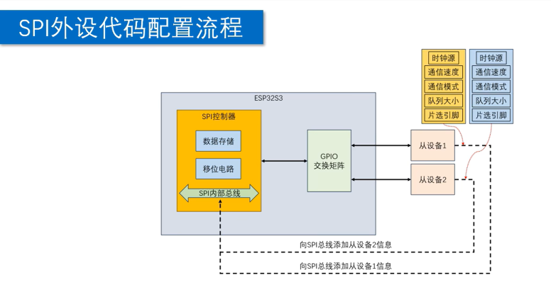

# SPI 配置指南

SPI 是 Serial Peripheral Interface，
常用于 ESP32 和显示屏、传感器、Flash、SD 卡等外设之间的高速同步通信。

ESP-IDF 中常见两类 SPI 使用方式：

- 普通 SPI master 设备
  先初始化 SPI 总线，
  再把一个或多个从设备挂到总线上，
  最后通过 transaction 进行读写。

- SD 卡 SPI 模式
  先初始化 SPI 总线，
  再通过 SD SPI + FatFS 挂载，
  挂载后使用文件读写接口访问 SD 卡。

---

## 初始化流程



普通 SPI master 典型顺序如下：

1. 选择 SPI host 和 GPIO。
2. 配置并初始化 SPI 总线。
3. 向 SPI 总线添加从设备。
4. 创建 transaction 并发送数据。
5. 不再使用时移除设备并释放总线。

SD 卡 SPI 模式典型顺序如下：

1. 初始化 SPI 总线。
2. 配置 `sdmmc_host_t`。
3. 配置 `sdspi_device_config_t`。
4. 配置 `esp_vfs_fat_mount_config_t`。
5. 调用 `esp_vfs_fat_sdspi_mount` 挂载。
6. 使用文件接口读写。
7. 不再使用时卸载 SD 卡。

---

## 常用概念

### Host

Host 表示 ESP32 内部的 SPI 控制器。

ESP-IDF 中常用：

- `SPI2_HOST`
  通用 SPI host。

- `SPI3_HOST`
  另一个通用 SPI host。

注意：

- `SPI0_HOST` 和 `SPI1_HOST` 通常和片上 Flash / PSRAM 相关。
- 普通外设优先使用 `SPI2_HOST` 或 `SPI3_HOST`。
- 旧版 ESP-IDF 或旧代码中可能看到 `HSPI_HOST`、`VSPI_HOST`。

### Bus

Bus 表示一组共享的 SPI 信号线。

常见信号：

- `MOSI`
  Master Out Slave In，
  主机输出、从机输入。

- `MISO`
  Master In Slave Out，
  主机输入、从机输出。

- `SCLK`
  SPI 时钟，
  由主机产生。

- `CS`
  Chip Select，
  片选信号。

多个从设备可以共享 `MOSI`、`MISO`、`SCLK`，
但通常每个从设备需要独立的 `CS` 引脚。

### Device

Device 表示挂载到 SPI 总线上的一个从设备。

每个设备通过 `spi_device_handle_t` 保存句柄。

后续读写该设备时，
都需要使用这个句柄。

### Transaction

Transaction 表示一次 SPI 传输。

一次 transaction 通常从 `CS` 有效开始，
经历命令、地址、dummy、写入、读取等阶段，
最后在 `CS` 释放时结束。

不同设备不一定使用全部阶段。
很多简单外设只需要写入或读取数据阶段。

---

## 1. 配置 SPI 总线

```c
#include "driver/spi_master.h"

#define SPI_HOST_ID   SPI2_HOST
#define PIN_NUM_MISO  19
#define PIN_NUM_MOSI  23
#define PIN_NUM_CLK   18

spi_bus_config_t spi_bus_cfg = {
    .miso_io_num = PIN_NUM_MISO,
    .mosi_io_num = PIN_NUM_MOSI,
    .sclk_io_num = PIN_NUM_CLK,
    .quadwp_io_num = -1,
    .quadhd_io_num = -1,
    .max_transfer_sz = 4096,
    .flags = SPICOMMON_BUSFLAG_MASTER,
    .intr_flags = 0,
};

spi_bus_initialize(
    SPI_HOST_ID,
    &spi_bus_cfg,
    SPI_DMA_CH_AUTO
);
```

`spi_bus_config_t` 用于描述 SPI 总线的 GPIO 和总线能力。

配置项说明：

- `miso_io_num`
  设置 MISO 引脚。
  如果当前设备只写不读，
  可以设置为 `-1`。

- `mosi_io_num`
  设置 MOSI 引脚。
  如果当前设备只读不写，
  可以设置为 `-1`。

- `sclk_io_num`
  设置 SCLK 引脚。
  常规 SPI 必须配置。

- `quadwp_io_num`
  Quad SPI 模式下的 WP / data2 引脚。
  普通单线 SPI 不使用时设置为 `-1`。

- `quadhd_io_num`
  Quad SPI 模式下的 HD / data3 引脚。
  普通单线 SPI 不使用时设置为 `-1`。

- `max_transfer_sz`
  单次 transaction 允许的最大传输字节数。
  如果设置为 `0`，
  DMA 模式下驱动会使用默认值；
  非 DMA 模式下通常受硬件 FIFO 长度限制。

- `flags`
  描述总线需要具备的能力。
  普通 master 场景常用 `SPICOMMON_BUSFLAG_MASTER`，
  Dual / Quad 模式需要再确认对应的 bus flag。

- `intr_flags`
  设置 SPI 中断分配参数。
  普通项目通常设置为 `0`。
  如果需要在 Flash 操作期间继续处理 SPI 中断，
  才考虑 `ESP_INTR_FLAG_IRAM`。

- `isr_cpu_id`
  部分 ESP-IDF 版本支持该字段，
  用于指定 SPI ISR 注册到哪个 CPU 核。
  普通项目可以保持默认。

注意：

- 不使用的 SPI 信号建议设置为 `-1`。
- 使用任意 GPIO 时，
  ESP-IDF 会通过 GPIO matrix 路由 SPI 信号。
- 高频 SPI 读数据时，
  GPIO matrix 和外设响应延迟都会影响最高可用频率。
- `max_transfer_sz` 是字节数，
  不是像素数。
  例如 `128 x 64` 单色屏如果按 1 bit 表示 1 像素，
  整帧缓存通常是 `128 * 64 / 8 = 1024` 字节。

`spi_bus_initialize` 的第三个参数用于配置 DMA：

- `SPI_DMA_CH_AUTO`
  由驱动自动选择 DMA 通道，
  推荐作为常规选择。

- `SPI_DMA_DISABLED`
  不启用 DMA。
  适合很短的低速传输，
  但单次传输长度会受到更多限制。

---

## 2. 添加 SPI 从设备

```c
#define PIN_NUM_CS  5

static spi_device_handle_t spi_dev_handle = NULL;

spi_device_interface_config_t spi_dev_cfg = {
    .spics_io_num = PIN_NUM_CS,
    .clock_source = SPI_CLK_SRC_DEFAULT,
    .clock_speed_hz = 10 * 1000 * 1000,
    .mode = 0,
    .queue_size = 3,
};

spi_bus_add_device(
    SPI_HOST_ID,
    &spi_dev_cfg,
    &spi_dev_handle
);
```

`spi_device_interface_config_t` 用于描述某一个从设备的通信参数。

配置项说明：

- `spics_io_num`
  设置该设备的 CS 引脚。
  如果不需要驱动自动控制 CS，
  可以设置为 `-1` 并手动控制。

- `clock_source`
  设置 SPI 时钟源。
  普通项目通常使用 `SPI_CLK_SRC_DEFAULT`。

- `clock_speed_hz`
  设置 SPI 时钟频率，
  单位为 Hz。
  该值应参考从设备数据手册。

- `mode`
  设置 SPI 模式，
  由 CPOL 和 CPHA 决定。

- `queue_size`
  设置最多可排队的 transaction 数量。
  如果只使用同步发送，
  `1 ~ 3` 通常足够。

SPI 模式速查：

| mode | CPOL | CPHA |
| --- | --- | --- |
| `0` | `0` | `0` |
| `1` | `0` | `1` |
| `2` | `1` | `0` |
| `3` | `1` | `1` |

注意：

- `clock_speed_hz` 不要一开始就拉满。
  调试阶段可以先用 `1 MHz` 或 `10 MHz`。
- `mode` 必须和从设备手册一致。
  模式错了通常会出现读写数据整体错位或完全无响应。
- 同一条 SPI 总线可以挂多个设备。
  每个设备使用自己的 `spi_device_handle_t`。
- 多设备共用 `MOSI`、`MISO`、`SCLK`，
  但每个设备通常需要独立 `CS`。
- 不同设备可以配置不同的时钟频率和 SPI mode，
  驱动会在访问对应设备时切换配置。

---

## 3. 执行 SPI 数据交换

### 发送并接收 1 字节

```c
uint8_t spi_transfer_byte(uint8_t data)
{
    spi_transaction_t spi_trans = {
        .flags =
            SPI_TRANS_USE_TXDATA |
            SPI_TRANS_USE_RXDATA,
        .length = 8,
        .tx_data = { data },
    };

    esp_err_t ret = spi_device_polling_transmit(
        spi_dev_handle,
        &spi_trans
    );

    if (ret != ESP_OK) {
        return 0;
    }

    return spi_trans.rx_data[0];
}
```

关键点：

- `length`
  表示数据阶段长度，
  单位是 bit。
  传输 1 字节时应设置为 `8`，
  传输 `len` 字节时应设置为 `len * 8`。

- `SPI_TRANS_USE_TXDATA`
  表示使用 `tx_data[4]` 发送少量数据。

- `SPI_TRANS_USE_RXDATA`
  表示使用 `rx_data[4]` 接收少量数据。

- `tx_data` / `rx_data`
  只适合不超过 4 字节的小数据。

### 发送并接收多字节

```c
esp_err_t spi_transfer_buffer(
    const uint8_t *tx_buf,
    uint8_t *rx_buf,
    size_t len
)
{
    spi_transaction_t spi_trans = {
        .length = len * 8,
        .tx_buffer = tx_buf,
        .rx_buffer = rx_buf,
    };

    return spi_device_transmit(
        spi_dev_handle,
        &spi_trans
    );
}
```

参数说明：

- `tx_buffer`
  指向发送缓冲区。
  如果只读不写，
  可以设置为 `NULL`。

- `rx_buffer`
  指向接收缓冲区。
  如果只写不读，
  可以设置为 `NULL`。

- `length`
  仍然以 bit 为单位。

常用发送函数：

- `spi_device_transmit`
  同步发送一个 transaction，
  内部使用队列并等待完成。

- `spi_device_polling_transmit`
  轮询等待传输完成。
  对短小、连续、低延迟传输更直接，
  但传输期间 CPU 会忙等。

- `spi_device_queue_trans`
  把 transaction 放入队列。

- `spi_device_get_trans_result`
  等待并取回队列中已完成的 transaction。

注意：

- DMA 传输使用 `tx_buffer` / `rx_buffer` 时，
  缓冲区最好放在 DMA 可访问内存中，
  并满足对齐要求。
- 如果只是发送命令字节、寄存器地址等短数据，
  使用 `tx_data` / `rx_data` 更简单。
- 不要同时使用 `tx_data` 和 `tx_buffer`。
  接收方向同理。

---

## 4. 释放 SPI 资源

```c
spi_bus_remove_device(spi_dev_handle);
spi_bus_free(SPI_HOST_ID);
```

释放顺序：

1. 先移除挂在总线上的设备。
2. 再释放 SPI 总线。

注意：

- 如果一条总线上挂了多个设备，
  必须先移除所有设备，
  再调用 `spi_bus_free`。
- 如果 SD 卡和其它 SPI 设备共用同一条总线，
  不要在其它设备仍在使用时释放总线。

---

## 普通 SPI 完整示例

```c
#include "driver/spi_master.h"

#define SPI_HOST_ID   SPI2_HOST
#define PIN_NUM_MISO  19
#define PIN_NUM_MOSI  23
#define PIN_NUM_CLK   18
#define PIN_NUM_CS    5

static spi_device_handle_t spi_dev_handle = NULL;

void spi_master_device_init(void)
{
    spi_bus_config_t bus_cfg = {
        .miso_io_num = PIN_NUM_MISO,
        .mosi_io_num = PIN_NUM_MOSI,
        .sclk_io_num = PIN_NUM_CLK,
        .quadwp_io_num = -1,
        .quadhd_io_num = -1,
        .max_transfer_sz = 4096,
        .flags = SPICOMMON_BUSFLAG_MASTER,
        .intr_flags = 0,
    };

    spi_bus_initialize(
        SPI_HOST_ID,
        &bus_cfg,
        SPI_DMA_CH_AUTO
    );

    spi_device_interface_config_t dev_cfg = {
        .spics_io_num = PIN_NUM_CS,
        .clock_source = SPI_CLK_SRC_DEFAULT,
        .clock_speed_hz = 10 * 1000 * 1000,
        .mode = 0,
        .queue_size = 3,
    };

    spi_bus_add_device(
        SPI_HOST_ID,
        &dev_cfg,
        &spi_dev_handle
    );
}

uint8_t spi_master_transfer_byte(uint8_t data)
{
    spi_transaction_t trans = {
        .flags =
            SPI_TRANS_USE_TXDATA |
            SPI_TRANS_USE_RXDATA,
        .length = 8,
        .tx_data = { data },
    };

    spi_device_polling_transmit(
        spi_dev_handle,
        &trans
    );

    return trans.rx_data[0];
}
```

以上示例表示：

- 使用 `SPI2_HOST`。
- `MOSI = GPIO23`。
- `MISO = GPIO19`。
- `SCLK = GPIO18`。
- `CS = GPIO5`。
- SPI 时钟为 `10 MHz`。
- SPI mode 为 `0`。

---

## SD 卡 SPI 模式

SD 卡使用 SPI 模式时，
仍然需要先初始化 SPI 总线。

但 SD 卡本身通常不手动调用 `spi_bus_add_device`。
`esp_vfs_fat_sdspi_mount` 会根据 SD SPI 配置，
把 SD 卡作为 SPI 设备挂到已初始化的 SPI 总线上，
并完成 SD 卡初始化、FATFS 挂载和 VFS 注册。

---

## 1. 初始化 SD 卡所在 SPI 总线

```c
#include "driver/spi_master.h"
#include "esp_vfs_fat.h"
#include "sdmmc_cmd.h"

#define SD_MOUNT_POINT  "/sdcard"
#define SD_SPI_HOST_ID  SPI2_HOST
#define SD_PIN_NUM_MISO 19
#define SD_PIN_NUM_MOSI 23
#define SD_PIN_NUM_CLK  18
#define SD_PIN_NUM_CS   5

sdmmc_card_t *tf_card = NULL;

spi_bus_config_t sd_bus_cfg = {
    .miso_io_num = SD_PIN_NUM_MISO,
    .mosi_io_num = SD_PIN_NUM_MOSI,
    .sclk_io_num = SD_PIN_NUM_CLK,
    .quadwp_io_num = -1,
    .quadhd_io_num = -1,
    .max_transfer_sz = 4096,
};

spi_bus_initialize(
    SD_SPI_HOST_ID,
    &sd_bus_cfg,
    SPI_DMA_CH_AUTO
);
```

`tf_card` 用于保存 SD 卡信息句柄。

挂载成功后可以用它打印卡信息，
卸载时也需要把它传回卸载函数。

---

## 2. 配置 SD SPI host

```c
sdmmc_host_t sdcard_host = SDSPI_HOST_DEFAULT();

sdcard_host.slot = SD_SPI_HOST_ID;
```

`SDSPI_HOST_DEFAULT()` 用于生成一份 SD over SPI 的默认 host 配置。

常见需要修改的是：

- `slot`
  指定使用哪一个 SPI host。
  应和前面 `spi_bus_initialize` 使用的 host 保持一致。

默认配置已经包含 SD SPI 驱动所需的大多数函数指针和频率配置。
普通项目通常只需要改 `slot`。

---

## 3. 配置 SD SPI 设备

```c
sdspi_device_config_t sd_dev_cfg =
    SDSPI_DEVICE_CONFIG_DEFAULT();

sd_dev_cfg.host_id = SD_SPI_HOST_ID;
sd_dev_cfg.gpio_cs = SD_PIN_NUM_CS;
```

`SDSPI_DEVICE_CONFIG_DEFAULT()` 用于生成 SD SPI 设备默认配置。

常见需要修改的是：

- `host_id`
  指定 SD 卡挂在哪一个 SPI host 上。

- `gpio_cs`
  指定 SD 卡 CS 引脚。

可选配置：

- `gpio_cd`
  Card Detect 引脚。
  没有接卡检测时保持默认即可。

- `gpio_wp`
  Write Protect 引脚。
  没有接写保护检测时保持默认即可。

- `gpio_int`
  SDIO 中断相关引脚。
  普通 SPI 模式通常不需要。

---

## 4. 配置 FatFS 挂载参数

```c
esp_vfs_fat_mount_config_t vfs_cfg = {
    .format_if_mount_failed = false,
    .max_files = 5,
    .allocation_unit_size = 16 * 1024,
    .disk_status_check_enable = false,
};
```

配置项说明：

- `format_if_mount_failed`
  挂载失败时是否自动格式化 SD 卡。
  如果 SD 卡中已有重要数据，
  应设置为 `false`。

- `max_files`
  允许同时打开的最大文件数。
  日志、配置文件等简单场景设置为 `3 ~ 5` 通常足够。

- `allocation_unit_size`
  格式化时使用的分配单元大小，
  也可以理解为 FATFS cluster 大小。
  值越大，
  连续读写大文件时可能更快，
  但存储大量小文件时会浪费更多空间。

- `disk_status_check_enable`
  是否启用真实磁盘状态检查。
  开启后可能降低 IO 性能。
  如果存在未正常卸载、热插拔等问题，
  可以考虑开启。

注意：

- `allocation_unit_size` 主要在触发格式化时影响新文件系统布局。
- 调试阶段不建议开启自动格式化，
  避免误格式化已有 SD 卡。

---

## 5. 挂载 SD 卡

```c
esp_vfs_fat_sdspi_mount(
    SD_MOUNT_POINT,
    &sdcard_host,
    &sd_dev_cfg,
    &vfs_cfg,
    &tf_card
);
```

参数说明：

- `SD_MOUNT_POINT`
  VFS 挂载路径。
  常用 `"/sdcard"`。

- `sdcard_host`
  SD SPI host 配置。

- `sd_dev_cfg`
  SD SPI 设备配置。

- `vfs_cfg`
  FatFS 挂载配置。

- `tf_card`
  返回 SD 卡信息句柄。

挂载成功后，
所有以 `"/sdcard"` 开头的文件路径都会映射到 SD 卡。

不再使用时卸载：

```c
esp_vfs_fat_sdcard_unmount(
    SD_MOUNT_POINT,
    tf_card
);
```

如果该 SPI 总线只给 SD 卡使用，
卸载后可以继续释放总线：

```c
spi_bus_free(SD_SPI_HOST_ID);
```

---

## SD 卡完整示例

```c
#include "driver/spi_master.h"
#include "esp_vfs_fat.h"
#include "sdmmc_cmd.h"

#define SD_MOUNT_POINT  "/sdcard"
#define SD_SPI_HOST_ID  SPI2_HOST
#define SD_PIN_NUM_MISO 19
#define SD_PIN_NUM_MOSI 23
#define SD_PIN_NUM_CLK  18
#define SD_PIN_NUM_CS   5

static sdmmc_card_t *tf_card = NULL;

void sdcard_spi_mount(void)
{
    spi_bus_config_t bus_cfg = {
        .miso_io_num = SD_PIN_NUM_MISO,
        .mosi_io_num = SD_PIN_NUM_MOSI,
        .sclk_io_num = SD_PIN_NUM_CLK,
        .quadwp_io_num = -1,
        .quadhd_io_num = -1,
        .max_transfer_sz = 4096,
    };

    spi_bus_initialize(
        SD_SPI_HOST_ID,
        &bus_cfg,
        SPI_DMA_CH_AUTO
    );

    sdmmc_host_t host = SDSPI_HOST_DEFAULT();
    host.slot = SD_SPI_HOST_ID;

    sdspi_device_config_t dev_cfg =
        SDSPI_DEVICE_CONFIG_DEFAULT();
    dev_cfg.host_id = SD_SPI_HOST_ID;
    dev_cfg.gpio_cs = SD_PIN_NUM_CS;

    esp_vfs_fat_mount_config_t mount_cfg = {
        .format_if_mount_failed = false,
        .max_files = 5,
        .allocation_unit_size = 16 * 1024,
        .disk_status_check_enable = false,
    };

    esp_vfs_fat_sdspi_mount(
        SD_MOUNT_POINT,
        &host,
        &dev_cfg,
        &mount_cfg,
        &tf_card
    );
}

void sdcard_spi_unmount(void)
{
    esp_vfs_fat_sdcard_unmount(
        SD_MOUNT_POINT,
        tf_card
    );

    spi_bus_free(SD_SPI_HOST_ID);
}
```

---

## FatFS 文件访问

SD 卡挂载到 VFS 后，
可以直接使用 C 标准文件接口。

写文件示例：

```c
FILE *file = fopen("/sdcard/log.txt", "a");

if (file != NULL) {
    fprintf(file, "hello sdcard\n");
    fclose(file);
}
```

读文件示例：

```c
char line[64];
FILE *file = fopen("/sdcard/log.txt", "r");

if (file != NULL) {
    while (fgets(line, sizeof(line), file) != NULL) {
        // handle line
    }

    fclose(file);
}
```

常见文件模式：

| 模式 | 含义 |
| --- | --- |
| `"r"` | 只读，文件必须存在 |
| `"w"` | 写入，文件不存在则创建，存在则清空 |
| `"a"` | 追加写入，文件不存在则创建 |
| `"r+"` | 读写，文件必须存在 |
| `"w+"` | 读写，文件不存在则创建，存在则清空 |
| `"a+"` | 读和追加写入，文件不存在则创建 |

注意：

- 写完重要数据后应及时 `fclose`。
- 长时间写日志时可以定期 `fflush`。
- 拔出 SD 卡前应先停止写入并卸载文件系统。
- 频繁小块写入会影响性能和 SD 卡寿命。
  日志类场景建议缓存后批量写入。

---

## 常见注意点

### 优先避开 SPI0 / SPI1

普通外设优先使用 `SPI2_HOST` 或 `SPI3_HOST`。

`SPI0_HOST` / `SPI1_HOST` 通常和 Flash、PSRAM、缓存访问有关，
普通项目不要随意占用。

### length 单位是 bit

`spi_transaction_t.length` 的单位是 bit。

常见写法：

```c
trans.length = len * 8;
```

不要把 `length` 写成数据值本身。
例如发送 1 字节 `0x55` 时，
`length` 应该是 `8`，
不是 `0x55 * 8`。

### 小数据和大数据用不同字段

小于等于 4 字节的数据可以使用：

- `tx_data`
- `rx_data`

同时需要设置：

- `SPI_TRANS_USE_TXDATA`
- `SPI_TRANS_USE_RXDATA`

大块数据使用：

- `tx_buffer`
- `rx_buffer`

两套字段不要混用。

### 多设备共享总线时注意任务并发

SPI master 驱动可以在同一条总线上挂多个设备。

但同一个设备如果被多个任务同时访问，
应用层应加互斥锁，
或统一由一个任务负责访问。

### SD 卡 SPI 模式速度较灵活但吞吐较低

SD 卡走 SPI 模式时，
引脚选择更灵活，
也可以和其它 SPI 设备共享总线。

但吞吐通常低于 SDMMC 1-bit / 4-bit 模式。
如果项目强依赖高速连续读写，
应优先评估 SDMMC 模式。

---

## 速查

1. `spi_bus_initialize`
   初始化 SPI 总线。

2. `spi_bus_add_device`
   向 SPI 总线添加从设备。

3. `spi_device_transmit`
   同步发送一个 SPI transaction。

4. `spi_device_polling_transmit`
   轮询方式发送一个 SPI transaction。

5. `spi_device_queue_trans`
   将 SPI transaction 放入队列。

6. `spi_device_get_trans_result`
   获取队列中已完成的 SPI transaction。

7. `spi_bus_remove_device`
   从总线移除 SPI 设备。

8. `spi_bus_free`
   释放 SPI 总线。

9. `SDSPI_HOST_DEFAULT`
   创建 SD SPI host 默认配置。

10. `SDSPI_DEVICE_CONFIG_DEFAULT`
    创建 SD SPI 设备默认配置。

11. `esp_vfs_fat_sdspi_mount`
    挂载 SPI 模式 SD 卡并注册到 VFS。

12. `esp_vfs_fat_sdcard_unmount`
    卸载 SD 卡并释放 FatFS 相关资源。

---

## 后续扩展复习点

以下内容来自原草稿中出现的生疏点和疑问点，
后续可以单独扩展成更深入的专题。

1. Quad / Dual / Octal SPI
   进一步理解 `quadwp_io_num`、`quadhd_io_num`、
   `data0_io_num ~ data7_io_num` 的用途。

2. SPI flags 体系
   区分 `spi_bus_config_t.flags`、
   `spi_device_interface_config_t.flags`、
   `spi_transaction_t.flags` 分别控制什么。

3. 中断和 IRAM
   深入理解 `intr_flags`、`ESP_INTR_FLAG_IRAM`、
   `pre_cb`、`post_cb`、Flash cache 关闭时的限制。

4. `isr_cpu_id`
   复习 SPI ISR 绑定 CPU 核、
   FreeRTOS 任务绑核、
   以及高频 SPI 任务调度之间的关系。

5. `max_transfer_sz` 计算
   按不同设备计算单次最大传输量：
   单色屏、RGB 屏、传感器批量读取、DMA 分块发送。

6. DMA 缓冲区要求
   复习 DMA-capable memory、
   4 字节对齐、
   `spi_bus_dma_memory_alloc` 的适用场景。

7. SPI 时钟和采样时序
   继续学习 `clock_source`、`clock_speed_hz`、
   `input_delay_ns`、`sample_point`、
   GPIO matrix 延迟和最高稳定频率。

8. SPI mode 读图能力
   通过设备手册时序图判断 CPOL / CPHA，
   并确认 mode `0 ~ 3` 应如何选择。

9. 队列传输模型
   进一步比较 `queue_size`、
   `spi_device_queue_trans`、
   `spi_device_get_trans_result`、
   polling transaction 的使用边界。

10. 多设备共享 SPI 总线
    复习不同设备共用总线时的 CS 管理、
    不同 mode / clock 切换、
    任务并发和互斥锁设计。

11. SD SPI 默认配置
    展开 `SDSPI_HOST_DEFAULT()` 和
    `SDSPI_DEVICE_CONFIG_DEFAULT()` 的完整默认字段。

12. FatFS 参数和文件系统行为
    深入理解 `allocation_unit_size`、
    `disk_status_check_enable`、
    小文件浪费空间、
    日志写入性能和异常断电保护。
