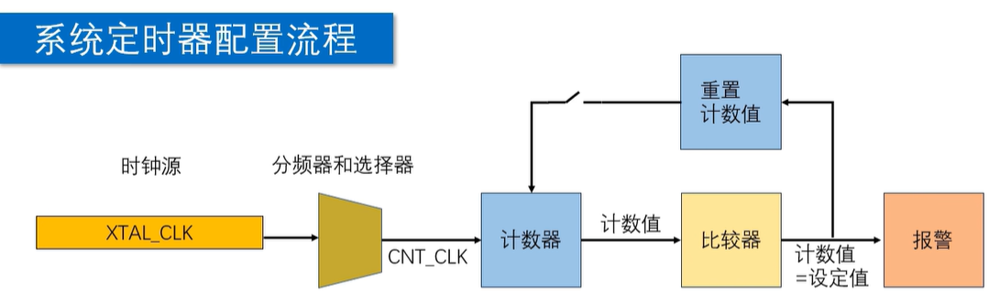

# SysTimer（系统定时器）指南

SysTimer 这里主要指 ESP-IDF 中的 `esp_timer`
高精度软件定时器接口。

它常用于一次性延时触发、周期性任务、
软件超时检测等场景。

`esp_timer` 的时间参数通常使用 `us` 作为单位。
创建定时器时不需要像 GPTimer 那样配置分辨率。

---

## 初始化流程



典型初始化顺序如下：

1. 定义定时器句柄。
2. 编写定时器回调函数。
3. 配置定时器创建参数。
4. 创建定时器。
5. 启动一次性或周期性定时器。
6. 不再使用时停止并删除定时器。

---

## 常用概念

### Handle

`esp_timer_handle_t` 表示一个 `esp_timer` 实例。

创建、启动、停止和删除定时器，
都需要通过这个句柄指定目标定时器。

### Callback

`callback` 是定时器到期后执行的函数。

默认情况下，
回调运行在 ESP Timer task 中。

### Dispatch Method

`dispatch_method` 决定回调如何被调度。

常用值：

- `ESP_TIMER_TASK`
  由 ESP Timer task 执行回调。

- `ESP_TIMER_ISR`
  在中断上下文中执行回调。

普通项目优先使用 `ESP_TIMER_TASK`。

### Once / Periodic

`esp_timer_start_once` 用于一次性触发。

`esp_timer_start_periodic` 用于周期性触发。

同一个定时器句柄启动后，
应先停止再改变启动方式。

### Time Unit

`esp_timer` 的启动参数单位是 `us`。

例如 `100000` 表示 `100 ms`。

---

## 1. 定义定时器句柄

```c
esp_timer_handle_t systimer_name = NULL;
```

`esp_timer_handle_t` 是 `esp_timer` 的句柄类型。

后续创建、启动、停止、删除等操作，
都需要通过这个句柄指定目标定时器。

---

## 2. 编写回调函数

```c
static void systimer_callback(void *arg)
{
    (void)arg;
}
```

回调函数的参数来自创建参数中的 `arg` 字段。

默认情况下，`esp_timer` 回调会在 ESP Timer task 中执行。
回调中应避免长时间阻塞，
否则可能影响后续定时器事件的处理。

注意：

- 回调函数返回值为 `void`。
- 如果使用 `ESP_TIMER_ISR`，
  回调会在中断上下文中运行。
- 中断回调中应避免调用不可在 ISR 中使用的函数。

---

## 3. 配置定时器创建参数

```c
esp_timer_create_args_t systimer_cfg = {
    .callback = systimer_callback,
    .arg = NULL,
    .dispatch_method = ESP_TIMER_TASK,
    .name = "systimer",
    .skip_unhandled_events = false,
};
```

配置项说明：

- `callback`
  定时器触发时调用的回调函数。

- `arg`
  传递给 `callback` 的用户参数。

- `dispatch_method`
  设置回调调度方式。
  常用值为 `ESP_TIMER_TASK`。

- `name`
  定时器名称。
  主要用于日志和调试定位。

- `skip_unhandled_events`
  用于周期性定时器。
  当事件积压时，设置是否跳过未处理事件。

一般周期性任务可以先使用：

```c
.dispatch_method = ESP_TIMER_TASK
```

只有确实需要更低延迟，
并且清楚 ISR 限制时，
再考虑使用 `ESP_TIMER_ISR`。

---

## 4. 创建定时器

```c
esp_err_t esp_timer_create(
    const esp_timer_create_args_t
        *create_args,
    esp_timer_handle_t *out_handle
);
```

该函数用于根据 `create_args` 创建定时器，
并通过 `out_handle` 返回定时器句柄。

示例：

```c
esp_timer_create(
    &systimer_cfg,
    &systimer_name
);
```

创建成功后，
定时器还不会自动开始计时。
需要继续调用启动函数。

---

## 5. 启动定时器

`esp_timer` 支持一次性定时器和周期性定时器。

### 一次性启动

```c
esp_err_t esp_timer_start_once(
    esp_timer_handle_t timer,
    uint64_t timeout_us
);
```

该函数用于启动一次性定时器。

当经过 `timeout_us` 后，
定时器触发一次回调。

示例：

```c
esp_timer_start_once(
    systimer_name,
    500000
);
```

以上配置表示 `500 ms` 后触发一次回调。

### 周期性启动

```c
esp_err_t esp_timer_start_periodic(
    esp_timer_handle_t timer,
    uint64_t period
);
```

该函数用于启动周期性定时器。

每经过 `period` 微秒，
定时器都会触发一次回调。

示例：

```c
esp_timer_start_periodic(
    systimer_name,
    100000
);
```

以上配置表示每 `100 ms` 触发一次回调。

---

## 6. 停止和删除定时器

停止定时器：

```c
esp_err_t esp_timer_stop(
    esp_timer_handle_t timer
);
```

删除定时器：

```c
esp_err_t esp_timer_delete(
    esp_timer_handle_t timer
);
```

常见顺序如下：

```c
esp_timer_stop(systimer_name);
esp_timer_delete(systimer_name);
```

如果定时器后续还要再次使用，
只需要停止即可。

如果定时器已经不再需要，
则可以删除并释放相关资源。

---

## 完整示例

```c
#include "esp_timer.h"

static void systimer_callback(void *arg)
{
    (void)arg;

    /* 定时器触发后执行的代码 */
}

void systimer_init(void)
{
    esp_timer_handle_t systimer_name = NULL;

    esp_timer_create_args_t
    systimer_cfg = {
        .callback = systimer_callback,
        .arg = NULL,
        .dispatch_method =
            ESP_TIMER_TASK,
        .name = "systimer",
        .skip_unhandled_events = false,
    };

    esp_timer_create(
        &systimer_cfg,
        &systimer_name
    );

    esp_timer_start_periodic(
        systimer_name,
        100000
    );
}
```

以上示例表示：

- 创建一个名为 `systimer` 的定时器。
- 回调函数为 `systimer_callback`。
- 使用 ESP Timer task 调度回调。
- 每 `100 ms` 触发一次回调。

---

## 常见注意点

### 时间单位

`esp_timer` 的启动参数单位为 `us`。

常见换算：

| 时间 | 参数值 |
| --- | --- |
| `1 ms` | `1000` |
| `10 ms` | `10000` |
| `100 ms` | `100000` |
| `1 s` | `1000000` |

### 回调不要做耗时操作

定时器回调中建议只做轻量操作，
例如设置标志位、发送队列消息等。

耗时逻辑可以放到普通 task 中处理。

### 一次性和周期性不要混用

同一个定时器句柄启动后，
不要重复调用启动函数。

如果需要改变模式或周期，
通常先停止定时器，
再重新启动。

---

## 速查

1. `esp_timer_create`
   创建定时器。

2. `esp_timer_start_once`
   启动一次性定时器。

3. `esp_timer_start_periodic`
   启动周期性定时器。

4. `esp_timer_stop`
   停止定时器。

5. `esp_timer_delete`
   删除定时器。

---

## 后续扩展复习点

1. SysTimer 和 GPTimer 的区别
   对比软件高精度定时器与硬件通用定时器的适用边界。

2. `ESP_TIMER_TASK` 和 `ESP_TIMER_ISR`
   复习两种回调调度方式的延迟、限制和使用条件。

3. `skip_unhandled_events`
   理解周期性事件积压时是否跳过未处理事件。

4. 低功耗和睡眠
   学习 light sleep / deep sleep 对 `esp_timer` 的影响。

5. 定时器回调转任务
   整理通过队列、信号量、事件组把工作转交给 task 的写法。
