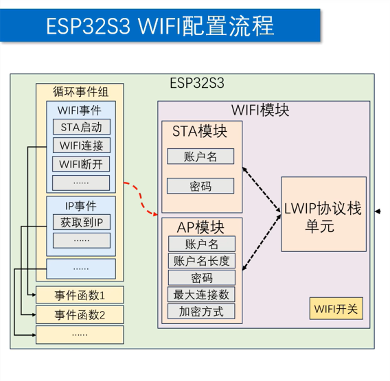

# WIFI 通信指南

ESP32 内置 Wi-Fi 模块，支持 2.4 GHz 频段的 802.11 b/g/n 协议。

ESP-IDF 中 Wi-Fi 使用的核心思路是：
先初始化 NVS、LWIP 协议栈和事件循环，
再配置 Wi-Fi 工作模式（STA 或 AP）和连接参数，
最后通过事件回调处理连接状态变化。

---

## 初始化流程



典型初始化顺序如下：

1. 初始化 NVS，为 Wi-Fi 配置存储提供底层支持。
2. 初始化 LWIP 协议栈。
3. 创建默认事件循环。
4. 注册 Wi-Fi 和 IP 事件处理函数。
5. 创建默认 Wi-Fi netif，将 Wi-Fi 驱动与 LWIP 协议栈绑定。
6. 初始化 Wi-Fi 配置。
7. 设置 Wi-Fi 工作模式（STA / AP / AP+STA）。
8. 配置 STA 或 AP 的参数（SSID、密码等）。
9. 启动 Wi-Fi 模块。
10. STA 模式下调用连接，AP 模式下等待客户端接入。
11. 不再使用时关闭 Wi-Fi 模块。

---

## 常用概念

### STA 模式

STA（Station）模式下，
ESP32 作为客户端连接到已有的 Wi-Fi 网络（如路由器）。

这是最常见的物联网设备联网方式。
ESP32 连接路由器后可以获得 IP 地址，
进而访问互联网或局域网内的其他设备。

### AP 模式

AP（Access Point）模式下，
ESP32 自身创建 Wi-Fi 热点，
其他设备（手机、电脑等）可以连接到 ESP32。

AP 模式下最多支持接入 4 个客户端（ESP-IDF 默认值）。

### AP+STA 模式

ESP32 同时运行 STA 和 AP 两个接口，
既可以连接到外部网络，
也可以接受其他设备连入。

### NVS

NVS（Non-Volatile Storage）是 ESP32 的非易失性键值存储。

Wi-Fi 驱动在内部使用 NVS 保存校准数据和配置信息，
因此在使用 Wi-Fi 之前必须先初始化 NVS。

### LWIP 和 netif

LWIP（Lightweight IP）是 ESP-IDF 内置的 TCP/IP 协议栈。

netif（Network Interface）是 Wi-Fi 驱动和 LWIP 之间的桥梁。
通过 `esp_netif_create_default_wifi_sta()` 或
`esp_netif_create_default_wifi_ap()` 创建默认 netif 后，
Wi-Fi 驱动才能和 TCP/IP 协议栈通信。

### 事件循环和事件处理

ESP-IDF 的 Wi-Fi 相关事件分为两类：

- **WIFI_EVENT**
  Wi-Fi 驱动层事件，
  例如 `WIFI_EVENT_STA_START`（STA 启动完成）、
  `WIFI_EVENT_STA_CONNECTED`（连接成功）、
  `WIFI_EVENT_STA_DISCONNECTED`（连接断开）。

- **IP_EVENT**
  IP 层事件，
  例如 `IP_EVENT_STA_GOT_IP`（STA 获取到 IP 地址）。

应用层通过向事件循环注册回调函数来响应这些事件。

---

## 1. 初始化 NVS

Wi-Fi 驱动的校准数据存储在 NVS 分区中，
使用 Wi-Fi 前必须先初始化 NVS。

```c
#include "nvs_flash.h"

esp_err_t ret = nvs_flash_init();

if (ret == ESP_ERR_NVS_NO_FREE_PAGES ||
    ret == ESP_ERR_NVS_NEW_VERSION_FOUND) {
    // NVS 分区被截断或版本不匹配，擦除后重试
    ESP_ERROR_CHECK(nvs_flash_erase());
    ret = nvs_flash_init();
}

ESP_ERROR_CHECK(ret);
```

注意：

- `nvs_flash_init()` 一般在 `app_main()` 中最先调用。
- 如果 NVS 分区空间不足或版本升级，
  需要先调用 `nvs_flash_erase()` 擦除后再初始化。
- 擦除 NVS 会丢失所有已保存的键值数据（如之前保存的 Wi-Fi 密码）。

---

## 2. 初始化 LWIP 协议栈

```c
#include "esp_netif.h"

esp_netif_init();
```

该函数初始化 LWIP 协议栈内部数据结构，
必须在创建事件循环之前调用。

---

## 3. 创建默认事件循环

```c
#include "esp_event.h"

esp_event_loop_create_default();
```

创建系统默认事件循环，
后续注册的事件处理函数都会绑定到这个事件循环上。

---

## 4. 注册事件处理函数

通过 `esp_event_handler_register()` 注册回调函数，
监听 Wi-Fi 和 IP 相关事件。

```c
#include "esp_event.h"
#include "esp_wifi.h"

// 注册 Wi-Fi 事件处理函数
esp_event_handler_register(
    WIFI_EVENT,          // 事件基：Wi-Fi 事件
    ESP_EVENT_ANY_ID,    // 事件 ID：监听所有 Wi-Fi 事件
    wifi_event_handler,  // 回调函数
    NULL                 // 传递给回调函数的参数
);

// 注册 IP 事件处理函数
esp_event_handler_register(
    IP_EVENT,            // 事件基：IP 事件
    IP_EVENT_STA_GOT_IP, // 事件 ID：仅监听获取到 IP 事件
    ip_event_handler,    // 回调函数
    NULL
);
```

参数说明：

- `event_base`
  事件基，`WIFI_EVENT` 或 `IP_EVENT`。

- `event_id`
  具体事件 ID。
  传入 `ESP_EVENT_ANY_ID` 表示监听该事件基下的所有事件。

- `event_handler`
  事件回调函数指针，
  类型为 `esp_event_handler_t`。

- `event_handler_arg`
  传递给回调函数的自定义参数，
  不需要时传入 `NULL`。

典型的事件回调函数：

```c
static void wifi_event_handler(
    void *arg,
    esp_event_base_t event_base,
    int32_t event_id,
    void *event_data
)
{
    if (event_base == WIFI_EVENT) {
        switch (event_id) {
        case WIFI_EVENT_STA_START:
            // STA 启动完成，可以在此调用 esp_wifi_connect()
            esp_wifi_connect();
            break;
        case WIFI_EVENT_STA_CONNECTED:
            // 已连接到 AP
            break;
        case WIFI_EVENT_STA_DISCONNECTED:
            // 连接断开，可以在此尝试重连
            esp_wifi_connect();
            break;
        }
    }
}

static void ip_event_handler(
    void *arg,
    esp_event_base_t event_base,
    int32_t event_id,
    void *event_data
)
{
    if (event_base == IP_EVENT &&
        event_id == IP_EVENT_STA_GOT_IP) {
        ip_event_got_ip_t *event =
            (ip_event_got_ip_t *)event_data;

        // event->ip_info.ip 中包含获取到的 IP 地址
        printf("Got IP: " IPSTR "\n",
               IP2STR(&event->ip_info.ip));
    }
}
```

常用事件一览：

| 事件基 | 事件 ID | 含义 |
| --- | --- | --- |
| `WIFI_EVENT` | `WIFI_EVENT_STA_START` | STA 启动完成 |
| `WIFI_EVENT` | `WIFI_EVENT_STA_CONNECTED` | STA 已连接到 AP |
| `WIFI_EVENT` | `WIFI_EVENT_STA_DISCONNECTED` | STA 连接断开 |
| `WIFI_EVENT` | `WIFI_EVENT_AP_START` | AP 启动完成 |
| `WIFI_EVENT` | `WIFI_EVENT_AP_STACONNECTED` | 有客户端连接到 AP |
| `WIFI_EVENT` | `WIFI_EVENT_AP_STADISCONNECTED` | 客户端从 AP 断开 |
| `IP_EVENT` | `IP_EVENT_STA_GOT_IP` | STA 获取到 IP 地址 |

---

## 5. 创建默认 Wi-Fi netif

将 Wi-Fi 驱动与 LWIP 协议栈绑定。

```c
// STA 模式
esp_netif_create_default_wifi_sta();

// AP 模式
esp_netif_create_default_wifi_ap();

// AP+STA 模式：同时创建两个
esp_netif_create_default_wifi_sta();
esp_netif_create_default_wifi_ap();
```

注意：

- 该函数必须在 `esp_netif_init()` 之后、
  `esp_wifi_start()` 之前调用。
- AP+STA 模式下需要分别创建 STA 和 AP 的 netif。
- 如果需要自定义 netif 配置（如设置静态 IP），
  可以用 `esp_netif_create_wifi()` 替代默认创建函数。

---

## 6. 初始化 Wi-Fi 配置

```c
wifi_init_config_t wifi_cfg = WIFI_INIT_CONFIG_DEFAULT();

esp_wifi_init(&wifi_cfg);
```

`WIFI_INIT_CONFIG_DEFAULT()` 使用默认的 Wi-Fi 初始化参数，
适用于大多数场景。

如需自定义，
`wifi_init_config_t` 常用字段：

- `nvs_enable`
  是否启用 NVS 存储 Wi-Fi 校准数据。
  默认启用，通常不需要修改。

- `osi_funcs`
  操作系统抽象层函数，
  默认值即可。

---

## 7. 设置 Wi-Fi 工作模式

```c
// STA 模式
esp_wifi_set_mode(WIFI_MODE_STA);

// AP 模式
esp_wifi_set_mode(WIFI_MODE_AP);

// AP+STA 模式
esp_wifi_set_mode(WIFI_MODE_APSTA);
```

`WIFI_MODE` 取值：

| 模式 | 含义 |
| --- | --- |
| `WIFI_MODE_STA` | 仅 Station 模式 |
| `WIFI_MODE_AP` | 仅 Access Point 模式 |
| `WIFI_MODE_APSTA` | 同时运行 STA 和 AP |

---

## 8. 配置模式参数

### STA 模式参数

```c
wifi_config_t wifi_sta_cfg = {
    .sta = {
        .ssid = "WIFI_NAME",
        .password = "WIFI_PASSWORD",
    }
};

esp_wifi_set_config(WIFI_IF_STA, &wifi_sta_cfg);
```

STA 参数说明：

- `ssid`
  要连接的目标 Wi-Fi 网络名称。
  字符串长度不超过 32 字节。

- `password`
  目标 Wi-Fi 网络密码。
  字符串长度不超过 64 字节。

- `scan_method`
  扫描方式，
  可选 `WIFI_FAST_SCAN`（快速扫描，默认）或 `WIFI_ALL_CHANNEL_SCAN`（全信道扫描）。

- `threshold.authmode`
  最低认证模式阈值。
  用于过滤扫描结果，
  默认 `WIFI_AUTH_WPA2_PSK` 会过滤掉开放网络和 WEP 网络。

### AP 模式参数

```c
wifi_config_t wifi_ap_cfg = {
    .ap = {
        .ssid = "ESP32_HOTSPOT",
        .ssid_len = 0,
        .password = "12345678",
        .channel = 1,
        .authmode = WIFI_AUTH_WPA2_PSK,
        .max_connection = 4,
    }
};

esp_wifi_set_config(WIFI_IF_AP, &wifi_ap_cfg);
```

AP 参数说明：

- `ssid`
  AP 热点名称。
  字符串长度不超过 32 字节。

- `ssid_len`
  SSID 的实际长度。
  设为 0 时自动使用 `strlen(ssid)`。

- `password`
  AP 热点密码。
  WPA2 模式下长度至少 8 字节。
  设为空字符串 `""` 或 `NULL` 表示开放网络。

- `channel`
  Wi-Fi 信道，取值范围 `1 ~ 13`。
  默认 1。

- `authmode`
  认证模式，可选值：`WIFI_AUTH_OPEN`（开放）、
  `WIFI_AUTH_WPA_PSK`、`WIFI_AUTH_WPA2_PSK`、
  `WIFI_AUTH_WPA_WPA2_PSK`（兼容模式）。

- `max_connection`
  最大客户端连接数，默认 4，最大取决于 ESP-IDF 配置。

---

## 9. 启动 Wi-Fi 模块

```c
esp_wifi_start();
```

该函数启动 Wi-Fi 驱动。

STA 模式下，
启动完成后会触发 `WIFI_EVENT_STA_START` 事件，
通常在此时调用 `esp_wifi_connect()` 发起连接：

```c
esp_wifi_connect();
```

AP 模式下，
启动完成后会触发 `WIFI_EVENT_AP_START` 事件，
热点开始广播，
等待客户端连接。

---

## 10. 关闭 Wi-Fi 模块

```c
esp_wifi_disconnect();  // 断开当前连接（STA 模式）
esp_wifi_stop();        // 停止 Wi-Fi 驱动
esp_wifi_deinit();      // 释放 Wi-Fi 资源
```

注意：

- `esp_wifi_stop()` 会销毁 Wi-Fi 驱动内部状态。
  再次使用需要重新从 `esp_wifi_init()` 开始。
- `esp_wifi_deinit()` 释放 Wi-Fi 驱动占用的内存。
- 先 `disconnect` 再 `stop` 可以避免异常断开导致的重连行为。

---

## 完整示例

以下是一个 STA 模式的最小可用示例：

```c
#include <stdio.h>
#include <string.h>
#include "freertos/FreeRTOS.h"
#include "freertos/event_groups.h"
#include "esp_wifi.h"
#include "esp_event.h"
#include "esp_netif.h"
#include "nvs_flash.h"
#include "esp_log.h"

#define WIFI_SSID        "YOUR_SSID"
#define WIFI_PASSWORD    "YOUR_PASSWORD"
#define WIFI_MAX_RETRY   5

static const char *TAG = "wifi_sta";
static int s_retry_num = 0;

static void wifi_event_handler(
    void *arg,
    esp_event_base_t event_base,
    int32_t event_id,
    void *event_data
)
{
    if (event_base == WIFI_EVENT) {
        switch (event_id) {
        case WIFI_EVENT_STA_START:
            esp_wifi_connect();
            break;
        case WIFI_EVENT_STA_DISCONNECTED:
            if (s_retry_num < WIFI_MAX_RETRY) {
                esp_wifi_connect();
                s_retry_num++;
                ESP_LOGI(TAG, "retry %d / %d",
                    s_retry_num, WIFI_MAX_RETRY);
            }
            break;
        }
    }
}

static void ip_event_handler(
    void *arg,
    esp_event_base_t event_base,
    int32_t event_id,
    void *event_data
)
{
    if (event_base == IP_EVENT &&
        event_id == IP_EVENT_STA_GOT_IP) {
        ip_event_got_ip_t *event =
            (ip_event_got_ip_t *)event_data;

        s_retry_num = 0;

        ESP_LOGI(TAG, "got ip: " IPSTR,
            IP2STR(&event->ip_info.ip));
    }
}

void wifi_init_sta(void)
{
    // 1. 初始化 NVS
    nvs_flash_init();

    // 2. 初始化 LWIP 协议栈
    esp_netif_init();

    // 3. 创建事件循环
    esp_event_loop_create_default();

    // 4. 创建 STA netif
    esp_netif_create_default_wifi_sta();

    // 5. 初始化 Wi-Fi
    wifi_init_config_t wifi_cfg =
        WIFI_INIT_CONFIG_DEFAULT();
    esp_wifi_init(&wifi_cfg);

    // 6. 注册事件处理函数
    esp_event_handler_register(
        WIFI_EVENT, ESP_EVENT_ANY_ID,
        wifi_event_handler, NULL
    );
    esp_event_handler_register(
        IP_EVENT, IP_EVENT_STA_GOT_IP,
        ip_event_handler, NULL
    );

    // 7. 设置模式并配置 STA 参数
    wifi_config_t sta_cfg = {
        .sta = {
            .ssid = WIFI_SSID,
            .password = WIFI_PASSWORD,
        }
    };

    esp_wifi_set_mode(WIFI_MODE_STA);
    esp_wifi_set_config(WIFI_IF_STA, &sta_cfg);

    // 8. 启动 Wi-Fi
    esp_wifi_start();
}

void app_main(void)
{
    wifi_init_sta();
}
```

以上示例表示：

- 使用 STA 模式连接路由器。
- 通过宏 `WIFI_SSID` 和 `WIFI_PASSWORD` 配置目标网络。
- 最多重连 5 次，超过后不再重试。
- 在 `WIFI_EVENT_STA_START` 事件中调用 `esp_wifi_connect()` 发起连接。
- 获取到 IP 地址后打印 IP。

---

## 常见注意点

### 必须先初始化 NVS

Wi-Fi 驱动依赖 NVS 存储校准数据。

如果未调用 `nvs_flash_init()` 就初始化 Wi-Fi，
`esp_wifi_init()` 会返回错误。

### 事件处理函数的注册顺序

事件处理函数必须在 `esp_wifi_init()` 之后、
`esp_wifi_start()` 之前注册。

如果在 `esp_wifi_start()` 之后注册，
可能会错过 `WIFI_EVENT_STA_START` 等关键事件。

### STA 模式下不要忘记调用 esp_wifi_connect()

`esp_wifi_start()` 只启动 Wi-Fi 驱动，
不会自动发起连接。

必须在 `WIFI_EVENT_STA_START` 事件回调中
调用 `esp_wifi_connect()` 才能连接到 AP。

### AP 模式密码长度限制

WPA2 模式下 AP 密码至少 8 个字符。

如果密码不足 8 位，
`esp_wifi_set_config()` 不会返回错误，
但启动 AP 时会失败。

### 连接断开后需要重新调用 esp_wifi_connect()

Wi-Fi 连接断开后，
驱动不会自动重连。

需要在 `WIFI_EVENT_STA_DISCONNECTED` 事件中
手动调用 `esp_wifi_connect()`。
建议设置最大重试次数，
避免无限重连。

### 事件回调中不要执行耗时操作

事件回调函数在事件循环线程上下文中执行，
阻塞过久会导致其他事件丢失。

耗时任务应通过 FreeRTOS 队列或任务通知
转发给其他任务处理。

---

## 速查

1. `nvs_flash_init`
   初始化 NVS 分区。

2. `esp_netif_init`
   初始化 LWIP 协议栈。

3. `esp_event_loop_create_default`
   创建默认事件循环。

4. `esp_event_handler_register`
   向事件循环注册事件处理函数。

5. `esp_netif_create_default_wifi_sta`
   创建 STA netif 并绑定 LWIP。

6. `esp_netif_create_default_wifi_ap`
   创建 AP netif 并绑定 LWIP。

7. `esp_wifi_init`
   使用 `wifi_init_config_t` 初始化 Wi-Fi 驱动。

8. `esp_wifi_set_mode`
   设置 Wi-Fi 工作模式（`WIFI_MODE_STA` / `WIFI_MODE_AP` / `WIFI_MODE_APSTA`）。

9. `esp_wifi_set_config`
   设置 STA 或 AP 模式的具体参数。

10. `esp_wifi_start`
    启动 Wi-Fi 驱动。

11. `esp_wifi_connect`
    发起 STA 连接。

12. `esp_wifi_disconnect`
    断开当前 STA 连接。

13. `esp_wifi_stop`
    停止 Wi-Fi 驱动。

14. `esp_wifi_deinit`
    释放 Wi-Fi 驱动占用的所有资源。

15. `esp_wifi_scan_start`
    启动 Wi-Fi 扫描，获取附近 AP 列表。

---

## 后续扩展复习点

1. Wi-Fi 扫描
   复习 `esp_wifi_scan_start()` 的用法和扫描结果解析，
   理解主动扫描和被动扫描的区别。

2. 静态 IP 配置
   学习通过 `esp_netif_dhcpc_stop()` 和
   `esp_netif_set_ip4_info()` 设置静态 IP 地址。

3. AP+STA 共存模式
   同时运行 STA 和 AP 时的信道限制、
   吞吐量影响和配置方法。

4. SmartConfig 和 WPS 配网
   学习 ESP-IDF 提供的 SmartConfig（ESPTouch / AirKiss）
   和 WPS 一键配网方案。

5. Wi-Fi 省电模式
   复习 `esp_wifi_set_ps()` 的省电模式类型
   及对延迟和功耗的影响。

6. Wi-Fi 吞吐量优化
   理解 `esp_wifi_set_protocol()`、速率协商、
   以及 TCP/IP 窗口大小对吞吐量性能的影响。

7. Wi-Fi 安全
   进一步学习 TLS/SSL 在 Wi-Fi 通信中的应用、
   证书配置和 HTTPS 客户端实现。

8. Wi-Fi Mesh
   复习 ESP-MESH 网络的组网原理、
   自愈合机制和典型应用场景。
